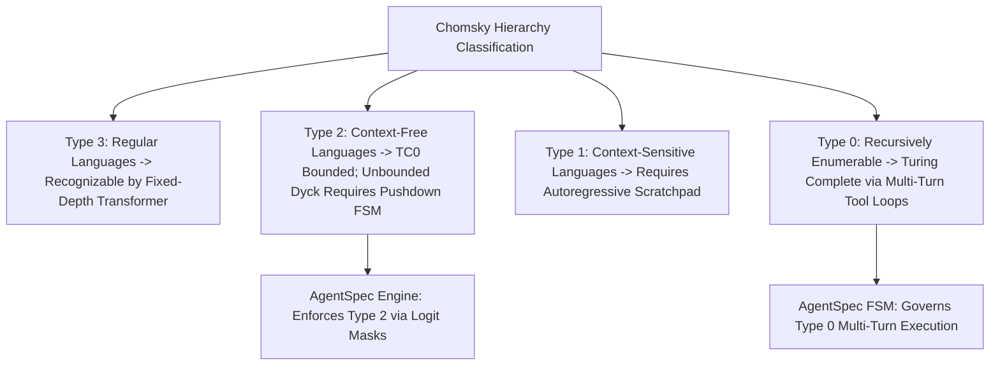

# Executive Summary

Understanding why Large Language Models fail at complex nested reasoning requires analyzing their computational expressivity through the lens of **Formal Language Theory and Circuit Complexity**.[^merrill-formal-languages-2022] Merrill et al. prove that standard soft-attention transformer decoders with bounded precision belong to the circuit complexity class $\mathsf{TC}^0$, rendering them incapable of recognizing general **Context-Free Grammars (CFGs)** (such as arbitrary depth Dyck-$k$ bracket matching) in a single feed-forward pass without external tokens.[^merrill-formal-languages-2022]

This theoretical foundation establishes that **machine-targeted agent architectures cannot rely purely on internal transformer weights for syntax and state tracking**.[^merrill-formal-languages-2022] Instead, structural determinism requires offloading grammar enforcement to **engine-level Finite-State Automata (FSMs)** via logit masking, while structuring prompts as **Restricted Access Sequence Processing (RASP)** vector registers.[^merrill-formal-languages-2022] [^willard-louf-2023]

*Diagram 1: Chomsky Hierarchy mapping to transformer circuit bounds and AgentSpec execution layers. Source: Merrill et al. / Deep Research (2026).*

---

# 1. Circuit Complexity Bounds of Self-Attention

Let a transformer layer compute multi-head self-attention over sequence length $n$:
$$\text{Attention}(Q, K, V) = \text{softmax}\left(\frac{QK^T}{\sqrt{d_k}}\right)V$$

Merrill et al. establish three mathematical limits on transformer sequence processing:[^merrill-formal-languages-2022]

1. **Uniform $\mathsf{TC}^0$ Equivalence**: Constant-depth transformers with log-precision weights can compute majority gates and threshold circuits, but cannot evaluate parity or graph connectivity without generating $O(n)$ scratchpad tokens.[^merrill-formal-languages-2022]
2. **State Tracking Saturation**: In natural language prose, attention heads must softly distribute attention weights across hundreds of unstructured tokens, causing state tracking dispersion.[^merrill-formal-languages-2022]
3. **Discrete Tag Focusing**: Explicit XML boundary tokens (`<tag>`, `</tag>`) serve as orthogonal basis vectors in embedding space, allowing attention heads to compute hard selection masks with near-zero attention entropy.[^merrill-formal-languages-2022]

---

# 2. Architectural Implications for Agent Design

Because transformers cannot natively guarantee pushdown automaton closure:
* **Offload Syntax to FSM Masks**: JSON brackets, string escapes, and schema commas MUST be governed by external FSM decoders (Outlines/XGrammar).[^willard-louf-2023]
* **Encode State Explicitly in Context**: Multi-step state machine transitions MUST be materialized as discrete XML state tokens rather than implicit latent activations.[^merrill-formal-languages-2022]

---

# Cross-Links & Related Concepts

* [Chomsky Hierarchy Primary Source Document](/sources/chomsky_hierarchy_transformers_merrill_2022.md)
* [Constrained Decoding and Grammars](/mechanisms/constrained_decoding_and_grammars.md)
* [Finite State Machine Agent DSL](/specifications/finite_state_machine_agent_dsl.md)

---

# References & Citations

[^merrill-formal-languages-2022]: Merrill, W., Sabharwal, A., & Smith, N. A. (2022, March 2). "Theoretical Limitations of Transformer Language Models on Formal Languages". *Transactions of the Association for Computational Linguistics (TACL)*, 10, pp. 1101–1117. arXiv:2203.00755. https://doi.org/10.48550/arXiv.2203.00755. Retrieved 2026-08-31.
[^willard-louf-2023]: Willard, B. T., & Louf, R. (2023, July 18). "Efficient Guided Generation for Large Language Models". *arXiv preprint*, arXiv:2307.09702. https://doi.org/10.48550/arXiv.2307.09702. Retrieved 2026-08-31.
