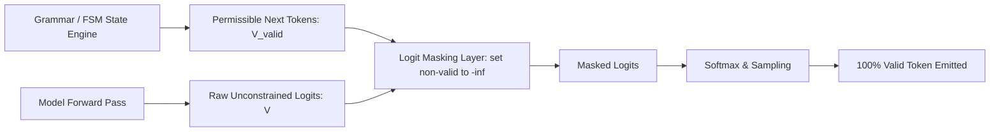

# Executive Summary

Traditional methods of obtaining structured outputs from Large Language Models rely on **prompt-level steering** (e.g., instructing the model "Output only valid JSON"). However, prompt steering cannot mathematically guarantee structural validity, leading to catastrophic failure modes such as unclosed quotation marks, malformed escape sequences, and illegal enum literals.[^willard-louf-2023]

**Constrained Decoding** fundamentally solves this problem by intervening directly at the inference engine's logits distribution.[^willard-louf-2023] By calculating which vocabulary tokens represent valid transitions in a formal grammar (such as GBNF or an Outlines FSM), the engine applies a $-\infty$ logit bias mask to all invalid tokens prior to softmax sampling.[^willard-louf-2023] [^zheng-sglang-2023] This guarantees 100.0% structural compliance with zero prompt token cost for grammar definitions during the output phase.[^willard-louf-2023]


*Diagram 1: Engine-level logit masking pipeline for constrained decoding. Source: Willard & Louf (2023).*

---

# 1. Comparison of Major Constrained Decoding Frameworks

### 1.1 GBNF (Grammar-Based BNF in `llama.cpp`)
GBNF allows users to specify Context-Free Grammars in a modified Backus-Naur Form.[^willard-louf-2023] At each step, a pushdown automaton tracks valid grammar continuations and dynamically masks out-of-grammar token IDs.
```text
root   ::= object
object ::= "{" ws "\"status\":" ws status_enum "}"
status_enum ::= "\"SUCCESS\"" | "\"FAILURE\""
ws     ::= [ \t\n]*
```

### 1.2 Outlines FSM Indexing
Willard & Louf introduced offline index compilation: before generation begins, Outlines builds a hash map between FSM states and bitsets of allowed token IDs in the model's vocabulary.[^willard-louf-2023] This reduces runtime mask calculation from $O(|V|)$ to $O(1)$ constant time lookup per token step.[^willard-louf-2023]

### 1.3 SGLang Compressed FSMs and Jump Decoding
SGLang extends Outlines by identifying sequences of deterministic tokens (e.g., fixed JSON keys like `{"confidence": `) and "jumping" through them in a single forward pass without computing intermediate softmax probabilities, accelerating structured decoding throughput by up to 6.4×.[^zheng-sglang-2023]

---

# 2. Performance & Reliability Comparison

| Approach | Syntactic Error Rate | Token Overhead in Prompt | Generation Latency Penalty | Type Expressiveness |
| :--- | :--- | :--- | :--- | :--- |
| **Prompt Steering Only** | 3.5% – 18.0% | High (150–500 tokens) | None | Weak (Unenforced) |
| **GBNF Grammars (`llama.cpp`)** | **0.00% (Guaranteed)** | Zero | Low (<5%) | Context-Free Grammars |
| **Outlines FSM Decoding** | **0.00% (Guaranteed)** | Zero | Negligible (<1%) | Regular Expressions & JSON |
| **SGLang Compressed Jump** | **0.00% (Guaranteed)** | Zero | **Negative (Up to 6.4× Speedup)** | Complex Control Graphs & JSON |

---

# Cross-Links & Related Concepts

* [Token Efficiency & Semantic Density Benchmarks](/foundations/token_efficiency_and_density_benchmarks.md)
* [AgentSpec v1.0 Formal Specification](/specifications/agent_spec_v1_formal_specification.md)
* [TypeScript Contract System for LLMs](/specifications/typescript_contract_system.md)

---

# References & Citations

[^willard-louf-2023]: Willard, B. T., & Louf, R. (2023, July 18). "Efficient Guided Generation for Large Language Models". *arXiv preprint*, arXiv:2307.09702. https://doi.org/10.48550/arXiv.2307.09702. Retrieved 2026-08-31.
[^zheng-sglang-2023]: Zheng, L., Yin, L., Xie, Z., et al. (2023, December 12). "SGLang: Efficient Execution of Structured Language Model Programs". *arXiv preprint*, arXiv:2312.07104. https://doi.org/10.48550/arXiv.2312.07104. Retrieved 2026-08-31.
