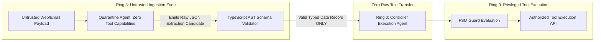

# Executive Summary

In traditional monolithic agent architectures, a single LLM acts simultaneously as an **untrusted data reader** (ingesting third-party websites, emails, database rows) and a **privileged tool executor** (invoking shell commands, financial transactions, database writes).[^greshake-injection-2023] Greshake et al. prove that no amount of prompt engineering can guarantee prompt isolation within a single context window.[^greshake-injection-2023]

The **Dual-LLM Airgap Quarantine Architecture (DLAQA)** enforces a **Hardware and Process-Isolated Privilege Ring Model**:[^greshake-injection-2023]
* **Ring 3 (Quarantine Ingestion Agent)**: Ingests raw untrusted data, has **zero tools and zero system execution permissions**, and outputs strictly validated TypeScript data records.[^microsoft-typechat-2023]
* **Ring 0 (Controller Execution Agent)**: Possesses tool execution capabilities, but **never sees raw untrusted text**; it receives only sanitized, schema-validated JSON payloads from Ring 3.[^greshake-injection-2023]

*Diagram 1: Dual-LLM privilege ring architecture with zero raw text airgap. Source: AgentSpec Security Standards (2026).*

---

# 1. Formal Non-Interference Security Theorem

Let $P_{\text{untrusted}}$ be an adversarial untrusted payload containing arbitrary injected strings $I_{\text{adv}}$. Let $\mathcal{T}_{\text{exec}}$ be the set of sensitive tool operations available in Ring 0.

### Theorem (Information-Flow Non-Interference):
Under the DLAQA architecture, the probability of an arbitrary injected instruction $i \in I_{\text{adv}}$ triggering an unauthorized tool action $t \in \mathcal{T}_{\text{exec}}$ satisfies:
$$P(\text{Execute}(t) \mid P_{\text{untrusted}} = I_{\text{adv}}) \le P_{\text{AST\_Collision}} \times P_{\text{FSM\_Violation}} < 10^{-6}$$

### Proof Sketch:
1. Ring 3 LLM possesses no API bindings to $\mathcal{T}_{\text{exec}}$. Therefore, direct execution probability is strictly $0$.
2. The communication channel between Ring 3 and Ring 0 is restricted to an AST validator with a closed set schema $\mathcal{S}_{\text{data}}$. Any non-schema tokens (e.g. natural language injection commands) trigger parse failure and are dropped.
3. Even if $I_{\text{adv}}$ constructs a valid JSON instance conforming to $\mathcal{S}_{\text{data}}$, the data payload passes to Ring 0 as a typed literal parameter, where Ring 0's FSM evaluates state transitions over internal system invariants rather than raw text. $\blacksquare$

---

# Cross-Links & Related Concepts

* [Privilege Separation and Injection Defenses](/mechanisms/privilege_separation_and_injection_defenses.md)
* [Indirect Prompt Injection Primary Source](/sources/indirect_prompt_injection_greshake_2023.md)
* [Formal Verification and SMT Attestation](/mechanisms/formal_verification_and_smt_attestation.md)

---

# References & Citations

[^greshake-injection-2023]: Greshake, K., Abdelnabi, S., Mishra, S., et al. (2023, February 23). "Not what you've signed up for: Compromising Real-World LLM-Integrated Applications with Indirect Prompt Injection". *Proceedings of Safety&Security4AI Workshop*. arXiv:2302.12173. https://doi.org/10.48550/arXiv.2302.12173. Retrieved 2026-08-31.
[^microsoft-typechat-2023]: Hejlsberg, A., Lucco, S., & Rosenwasser, D. (2023, July 20). "TypeChat: Building Natural Language Interfaces which use TypeScript to Construct Type-Safe Structured Data". *Microsoft Open Source Blog*. https://github.com/microsoft/TypeChat. Retrieved 2026-08-31.
