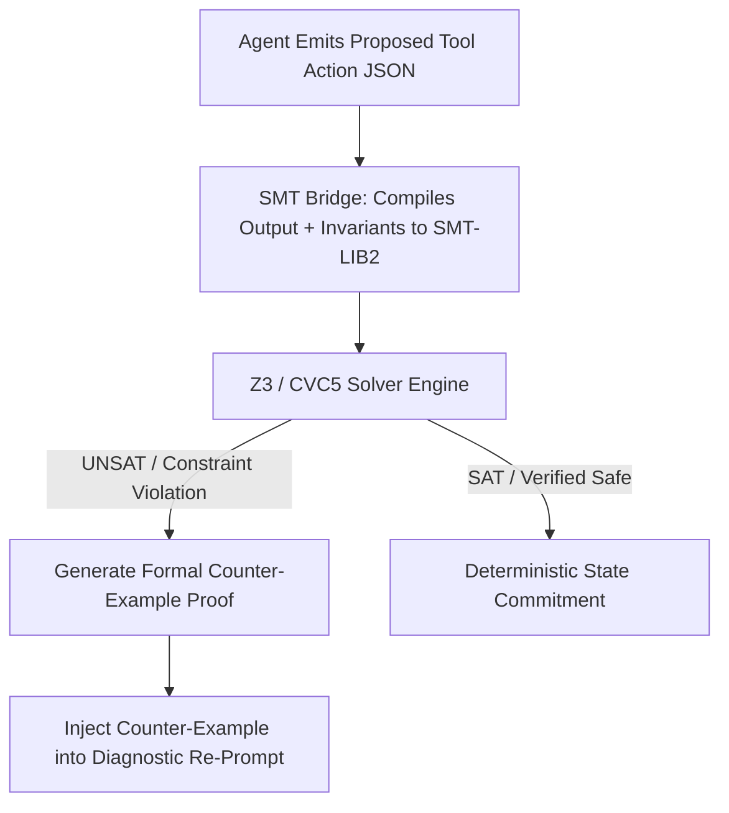

# Executive Summary

While LLM agents can evaluate simple invariant checks during their reasoning pass, neural generation is inherently stochastic and cannot provide mathematical guarantees of safety in high-stakes environments (e.g. database schema migrations, cloud resource provisioning, automated trading).[^microsoft-typechat-2023]

**SMT Solver Attestation** bridges generative agent outputs with deterministic **Satisfiability Modulo Theories (SMT)** theorem provers (such as Microsoft Z3 or CVC5).[^willard-louf-2023] In this architecture, AgentSpec's `<invariants>` and schema bounds are compiled into formal first-order logic constraints; the proposed action is committed if and only if the SMT solver returns a verified `SAT` (Satisfiable) theorem proof within $<5\text{ ms}$.[^microsoft-typechat-2023]


*Diagram 1: Formal SMT solver attestation and counter-example feedback loop. Source: AgentSpec Attestation Protocol (2026).*

---

# 1. SMT-LIB2 Constraint Compilation Example

Consider an AgentSpec invariant defining bounds on financial transaction allocations:
```text
ASSERT: total_allocation == sum(allocations)
ASSERT: forall x in allocations: x.amount >= 100 AND x.amount <= max_single_limit
ASSERT: count(allocations) <= 10
```

The runtime translates this into an SMT-LIB2 assertion block evaluated by Z3:
```smt2
(declare-const total_allocation Int)
(declare-const alloc_1 Int)
(declare-const alloc_2 Int)
(declare-const max_limit Int)

(assert (= max_limit 5000))
(assert (and (>= alloc_1 100) (<= alloc_1 max_limit)))
(assert (and (>= alloc_2 100) (<= alloc_2 max_limit)))
(assert (= total_allocation (+ alloc_1 alloc_2)))

(check-sat)
```

---

# 2. Programmatic Counter-Example Feedback

When an action violates an invariant, the SMT solver produces an exact mathematical counter-example (e.g., `alloc_1 = 5200 exceeds max_limit = 5000`). This counter-example is injected directly into the next agent turn, allowing the LLM to fix the parameter without guesswork.[^microsoft-typechat-2023]

---

# Cross-Links & Related Concepts

* [Invariant Assertions and Negative Constraints](/mechanisms/invariant_assertions_and_negative_constraints.md)
* [TypeScript Contract System for LLMs](/specifications/typescript_contract_system.md)
* [AgentSpec v1.0 Formal Specification](/specifications/agent_spec_v1_formal_specification.md)

---

# References & Citations

[^microsoft-typechat-2023]: Hejlsberg, A., Lucco, S., & Rosenwasser, D. (2023, July 20). "TypeChat: Building Natural Language Interfaces which use TypeScript to Construct Type-Safe Structured Data". *Microsoft Open Source Blog*. https://github.com/microsoft/TypeChat. Retrieved 2026-08-31.
[^willard-louf-2023]: Willard, B. T., & Louf, R. (2023, July 18). "Efficient Guided Generation for Large Language Models". *arXiv preprint*, arXiv:2307.09702. https://doi.org/10.48550/arXiv.2307.09702. Retrieved 2026-08-31.
