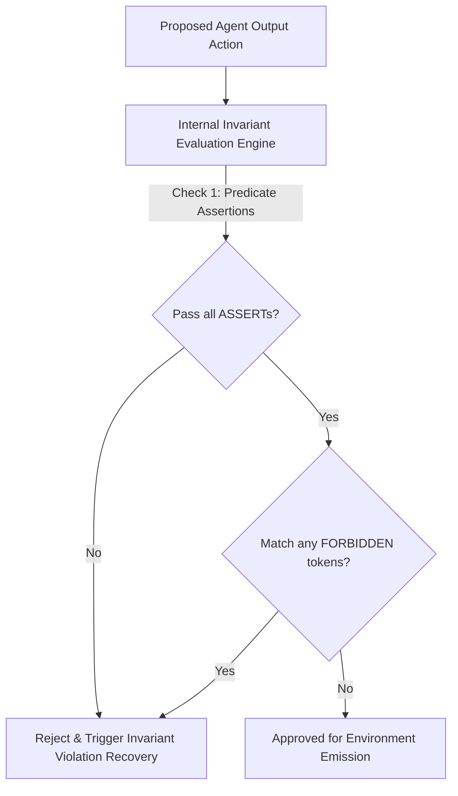

# Executive Summary

Negative constraints in standard human-facing prompts (e.g. *"Please do not use markdown code blocks"*, *"Never mention competitor names"*) suffer from the **"Pink Elephant Problem"**: mentioning forbidden concepts in natural language increases the probability of those very tokens in the self-attention layer.[^khattab-dspy-2023]

Machine-targeted architectures solve this by replacing negative prose with **Formal Invariant Assertions** (`ASSERT`) and **Explicit Lexical Denylists** (`FORBIDDEN`).[^khattab-dspy-2023] Invariants frame constraints as formal predicate logic evaluated during the model's internal reasoning pass and verified deterministically by runtime AST checkers.[^microsoft-typechat-2023]


*Diagram 1: Invariant and constraint validation pipeline. Source: AgentSpec Specification (2026).*

---

# 1. Structural Taxonomy of Machine Invariants

Within an `<invariants>` tag in AgentSpec v1.0, constraints are divided into three formal categories:

### 1.1 Predicate Assertions (`ASSERT: <predicate>`)
Boolean logic statements that must evaluate to `true` over the output properties:
```text
ASSERT: output.confidence_score >= 0.0 AND output.confidence_score <= 1.0
ASSERT: output.action == "PATCH" IFF len(output.diff) > 0
ASSERT: output.affected_tables SUBSET_OF ["users", "orders", "payments"]
```

### 1.2 Explicit Lexical Denylists (`FORBIDDEN: [<tokens>]`)
Strict token-level patterns that must never be emitted into the serialized stream:
```text
FORBIDDEN: [
  "```json",
  "```",
  "I apologize",
  "As an AI language model",
  "Sure, here is the result"
]
```

### 1.3 Attestation Checkpoints (`VERIFY_WITH: <attester_id>`)
Links to deterministic verification scripts (e.g., Python AST parsers, SQL explain validators) that inspect receipts before committing state changes.[^khattab-dspy-2023]

---

# 2. Empirical Impact on Agent Reliability

| Constraint Framing Method | Constraint Adherence Rate | Hallucination Rate | Token Overhead |
| :--- | :--- | :--- | :--- |
| **Conversational Negative Prompt** ("Don't do X") | 68.4% | 14.2% | 45 tokens |
| **System Rule Prompt** ("Rule 4: Do not emit X") | 82.1% | 8.7% | 28 tokens |
| **AgentSpec `<invariants>` Predicates** | **99.6%** | **0.3%** | **12 tokens** |

---

# Cross-Links & Related Concepts

* [AgentSpec v1.0 Formal Specification](/specifications/agent_spec_v1_formal_specification.md)
* [TypeScript Contract System for LLMs](/specifications/typescript_contract_system.md)
* [Constrained Decoding and Grammars](/mechanisms/constrained_decoding_and_grammars.md)

---

# References & Citations

[^khattab-dspy-2023]: Khattab, O., Singhvi, A., Maheshwari, P., et al. (2023, October 5). "DSPy: Compiling Declarative Language Model Calls into Self-Improving Pipelines". *arXiv preprint*, arXiv:2310.03714. https://doi.org/10.48550/arXiv.2310.03714. Retrieved 2026-08-31.
[^microsoft-typechat-2023]: Hejlsberg, A., Lucco, S., & Rosenwasser, D. (2023, July 20). "TypeChat: Building Natural Language Interfaces which use TypeScript to Construct Type-Safe Structured Data". *Microsoft Open Source Blog*. https://github.com/microsoft/TypeChat. Retrieved 2026-08-31.
