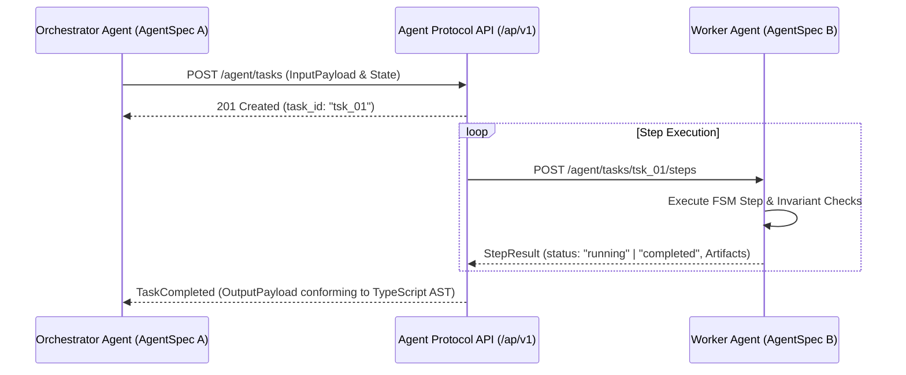

# Executive Summary

As multi-agent architectures scale from single-agent loops to hierarchical orchestrator-worker swarms, communication between agents must transition from conversational natural language dialogue to **strongly-typed state packets**.[^aief-agent-protocol-2023] Natural language delegation (e.g. *"Can you analyze this and let me know?"*) introduces semantic drift, lost state, and untracked failures.[^yao-react-2022]

The **Agent Protocol** (spearheaded by the AI Engineer Foundation and E2B) defines a standardized REST/JSON interface for task lifecycle management.[^aief-agent-protocol-2023] By bridging Agent Protocol's task/step primitives with **AgentSpec's TypeScript contracts**, machine-to-machine handoffs achieve zero-loss context serialization and deterministic completion verification.[^aief-agent-protocol-2023] [^anthropic-mcp-2024]

*Diagram 1: Multi-agent task delegation and step execution lifecycle via Agent Protocol. Source: Agent Protocol Standard (2026).*

---

# 1. Core Protocol Primitives

The standard defines four foundational entities for machine-to-machine coordination:[^aief-agent-protocol-2023]

1. **Task (`/agent/tasks`)**: The top-level objective container carrying immutable initial parameters and execution bounds.[^aief-agent-protocol-2023]
2. **Step (`/agent/tasks/{id}/steps`)**: A single atomic transition within an agent's internal FSM, emitting structured tool calls or status changes.[^aief-agent-protocol-2023]
3. **Artifact (`/agent/tasks/{id}/artifacts`)**: Content-addressed data files (code diffs, SQLite databases, PDF papers) passed between agents by reference rather than inlined in context.[^aief-agent-protocol-2023]
4. **Handoff Packet**: A JSON payload conforming to the receiving agent's `InputPayload` TypeScript interface, ensuring type-safe multi-agent delegation.[^aief-agent-protocol-2023]

---

# 2. Preventing Multi-Agent Cascading Failures

1. **Strict Type Gates at Boundaries**: If Agent A emits a handoff payload that fails the TypeScript AST checker for Agent B's `InputPayload`, the protocol layer rejects the transfer immediately before invoking Agent B's LLM, saving compute and preventing corrupted sub-agent runs.[^aief-agent-protocol-2023]
2. **Content-Addressed Artifact References**: Large datasets and execution receipts are passed as URI references (e.g. `artifact://tsk_01/delta.patch`) rather than raw tokens, keeping context utilization flat across deep agent swarms.[^anthropic-mcp-2024]

---

# Cross-Links & Related Concepts

* [AgentSpec v1.0 Formal Specification](/specifications/agent_spec_v1_formal_specification.md)
* [Model Context Protocol Bridge](/protocols/mcp_agent_spec_bridge.md)
* [ReAct Agent Reasoning Paradigm](/sources/react_agent_reasoning_yao_2022.md)

---

# References & Citations

[^aief-agent-protocol-2023]: AI Engineer Foundation & E2B (2023, September 1). "Agent Protocol: Universal Specification for Autonomous Agent Orchestration". *AI Engineer Foundation*. https://agentprotocol.ai. Retrieved 2026-08-31.
[^anthropic-mcp-2024]: Anthropic (2024, November 25). "Model Context Protocol: An Open Standard for Connecting AI Models to Tools and Data". *Anthropic Engineering*. https://modelcontextprotocol.io/introduction. Retrieved 2026-08-31.
[^yao-react-2022]: Yao, S., Zhao, J., Yu, D., et al. (2022, October 6). "ReAct: Synergizing Reasoning and Acting in Language Models". *International Conference on Learning Representations (ICLR 2023)*. arXiv:2210.03629. https://doi.org/10.48550/arXiv.2210.03629. Retrieved 2026-08-31.
