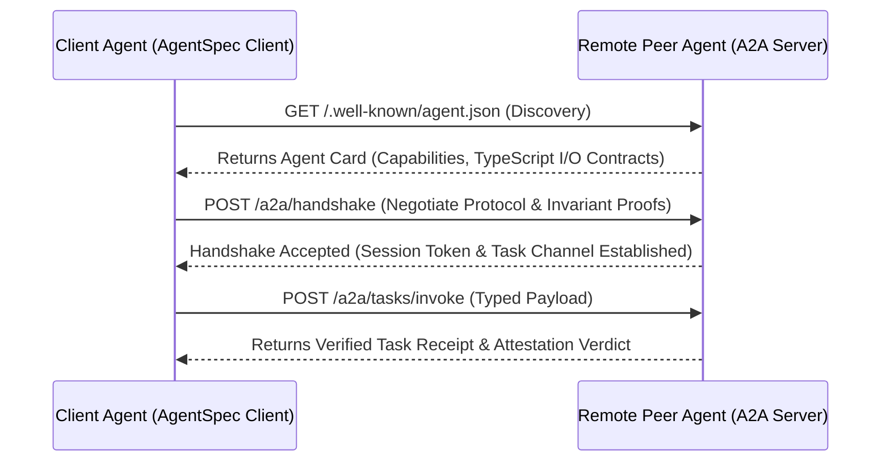

# Executive Summary

In heterogeneous multi-agent systems spanning diverse organizations, frameworks, and model providers, agents must discover peers, negotiate capabilities, and establish strongly-typed communication contracts dynamically.[^aief-agent-protocol-2023] 

The **Agent-to-Agent (A2A) Protocol** defines an open, decentralized standard for autonomous inter-agent coordination.[^aief-agent-protocol-2023] By combining self-describing **Agent Cards (JSON/TypeScript descriptors)**, **cryptographic authentication handshakes**, and **dynamic schema negotiation**, A2A enables autonomous agents to delegate tasks with zero human configuration while preventing unauthorized privilege escalation.[^anthropic-mcp-2024] [^microsoft-typechat-2023]


*Diagram 1: Decentralized Agent-to-Agent (A2A) discovery, handshake, and invocation flow. Source: A2A Specification (2026).*

---

# 1. The Agent Card (`/.well-known/agent.json`)

Every A2A-compliant agent exposes a machine-readable descriptor document defining its capabilities, pricing, latency SLAs, and TypeScript interface contracts:[^anthropic-mcp-2024]

```json
{
  "a2a_version": "1.0.0",
  "agent_id": "org.security.static_analyzer",
  "name": "Static Vulnerability Analyzer",
  "description": "High-throughput AST security scanner for Python and Go",
  "authentication": {
    "type": "bearer_token",
    "scopes": ["read:code", "audit:write"]
  },
  "interface_contracts": {
    "input_schema_uri": "https://specs.corp.internal/schemas/vuln_input.d.ts",
    "output_schema_uri": "https://specs.corp.internal/schemas/vuln_output.d.ts"
  },
  "capabilities": {
    "max_payload_bytes": 10485760,
    "sla_max_latency_ms": 5000,
    "concurrency_limit": 16
  }
}
```

---

# 2. Dynamic Contract Negotiation Handshake

During the initial handshake (`POST /a2a/handshake`), the participating agents agree on:
1. **Schema Version Match**: Validates compatibility between caller's output type and callee's `InputPayload` interface.[^microsoft-typechat-2023]
2. **Invariant Alignment**: Verifies that both agents share common security invariants and data handling policies.[^aief-agent-protocol-2023]
3. **Transport Protocol**: Selects the optimal wire transport (`stdio`, WebSocket, or `HTTP/SSE`).[^anthropic-mcp-2024]

---

# Cross-Links & Related Concepts

* [Agent Protocol and Multi-Agent Handoffs](/protocols/agent_protocol_and_multi_agent_handoffs.md)
* [Model Context Protocol Bridge](/protocols/mcp_agent_spec_bridge.md)
* [DAG Multi-Agent Orchestration](/protocols/dag_multi_agent_orchestration_topologies.md)

---

# References & Citations

[^aief-agent-protocol-2023]: AI Engineer Foundation & E2B (2023, September 1). "Agent Protocol: Universal Specification for Autonomous Agent Orchestration". *AI Engineer Foundation*. https://agentprotocol.ai. Retrieved 2026-08-31.
[^anthropic-mcp-2024]: Anthropic (2024, November 25). "Model Context Protocol: An Open Standard for Connecting AI Models to Tools and Data". *Anthropic Engineering*. https://modelcontextprotocol.io/introduction. Retrieved 2026-08-31.
[^microsoft-typechat-2023]: Hejlsberg, A., Lucco, S., & Rosenwasser, D. (2023, July 20). "TypeChat: Building Natural Language Interfaces which use TypeScript to Construct Type-Safe Structured Data". *Microsoft Open Source Blog*. https://github.com/microsoft/TypeChat. Retrieved 2026-08-31.
