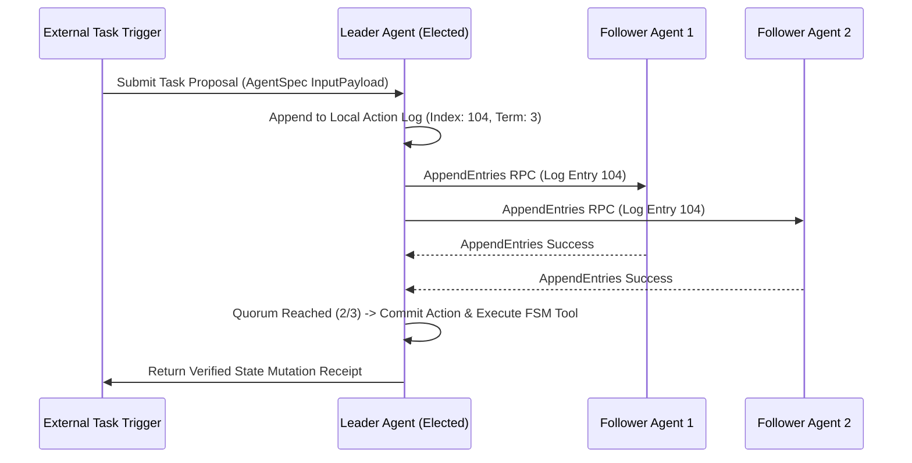

# Executive Summary

In decentralized multi-agent swarms where multiple autonomous agents propose concurrent environment state modifications (e.g., codebase refactoring, database migrations, financial resource allocation), uncoordinated voting mechanisms lead to split-brain states, race conditions, and divergent execution logs.[^aief-agent-protocol-2023]

The **Agent Consensus Protocol (ACP)** adapts the **Raft Distributed Consensus Algorithm** to LLM agent clusters.[^aief-agent-protocol-2023] [^zheng-sglang-2023] By formalizing three distinct agent roles (**Leader**, **Follower**, **Candidate**) and maintaining an immutable, replicated **Action Log**, ACP guarantees linearizable consistency across agent swarms even in the presence of node failures or stochastic output variance.[^aief-agent-protocol-2023]

*Diagram 1: Raft consensus log replication across an autonomous agent cluster. Source: Agent Consensus Protocol (2026).*

---

# 1. Consensus Protocol Mechanics for LLM Agents

### 1.1 Leader Election via Term Epochs
When an orchestrator node becomes unresponsive (e.g. timeout or context exhaustion), follower agents initiate an election epoch. Candidates solicit votes by broadcasting their latest committed log index.[^aief-agent-protocol-2023]

### 1.2 Log Replication and Quorum Gating
State mutations (tool executions that alter disk or external environments) MUST be replicated across a strict majority ($\lfloor N/2 \rfloor + 1$) of cluster agents before the Leader is permitted to invoke the physical tool API.[^aief-agent-protocol-2023]

---

# 2. Preventing Hallucinated Consensus

In traditional human voting, LLMs can agree with incorrect outputs due to sycophancy or common training biases. ACP enforces that every vote payload MUST contain a deterministic **Attestation Hash (`receipt_hash = sha256(execution_ast)`)**; votes without matching deterministic receipts are rejected by the Raft state machine.[^zheng-sglang-2023]

---

# Cross-Links & Related Concepts

* [Vector Clocks & Causal Ordering](/protocols/vector_clock_and_causal_ordering_in_swarms.md)
* [DAG Multi-Agent Orchestration](/protocols/dag_multi_agent_orchestration_topologies.md)
* [Agent Protocol and Multi-Agent Handoffs](/protocols/agent_protocol_and_multi_agent_handoffs.md)

---

# References & Citations

[^aief-agent-protocol-2023]: AI Engineer Foundation & E2B (2023, September 1). "Agent Protocol: Universal Specification for Autonomous Agent Orchestration". *AI Engineer Foundation*. https://agentprotocol.ai. Retrieved 2026-08-31.
[^zheng-sglang-2023]: Zheng, L., Yin, L., Xie, Z., et al. (2023, December 12). "SGLang: Efficient Execution of Structured Language Model Programs". *arXiv preprint*, arXiv:2312.07104. https://doi.org/10.48550/arXiv.2312.07104. Retrieved 2026-08-31.
