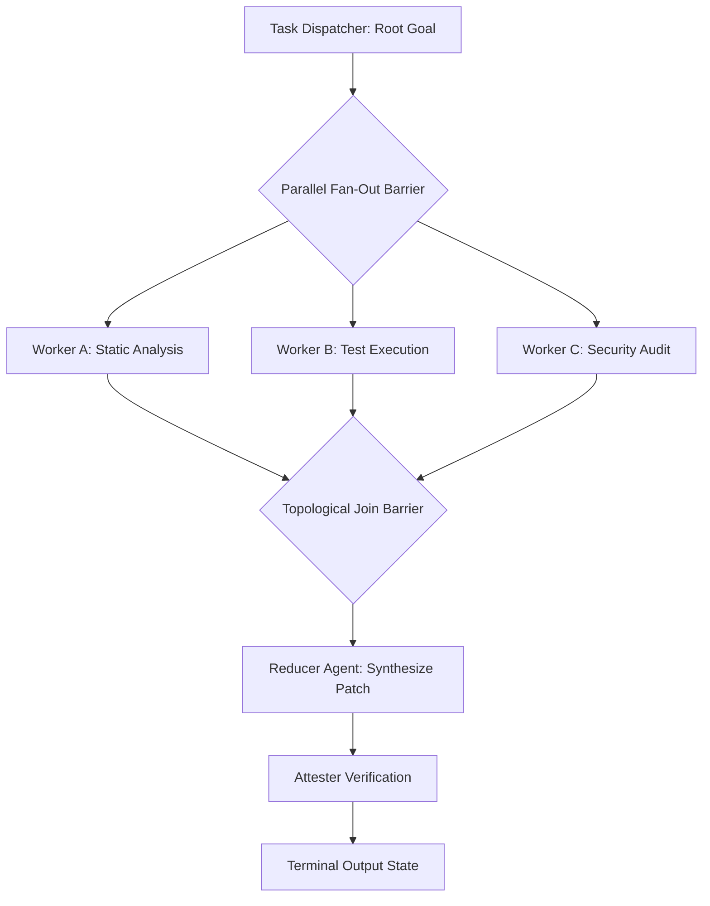

# Executive Summary

Linear sequential agent execution ($A \rightarrow B \rightarrow C$) introduces high cumulative latency and single-point-of-failure fragility in complex analytical workloads.[^yao-react-2022] Conversely, uncoordinated autonomous swarms frequently suffer from race conditions, conflicting state writes, and redundant duplicate work.[^aief-agent-protocol-2023]

The **DAG Orchestration Topology** models multi-agent execution as a formal Directed Acyclic Graph $G = (V, E)$, where vertices $v \in V$ represent isolated, strongly typed AgentSpec instances and directed edges $e = (u, v) \in E$ represent typed data dependencies.[^aief-agent-protocol-2023] [^zheng-sglang-2023] By leveraging **topological sorting**, **parallel fan-out (map)**, and **deterministic barrier reductions (reduce)**, DAG topologies maximize parallelism while guaranteeing causal deterministic state convergence.[^zheng-sglang-2023]


*Diagram 1: Directed Acyclic Graph (DAG) multi-agent map-reduce execution pipeline. Source: Multi-Agent Orchestration Protocol (2026).*

---

# 1. Formal DAG Schema Specification

In AgentSpec multi-agent configurations, a DAG topology is declared via a `<dag_orchestration>` specification:

```xml
<dag_orchestration id="security_audit_pipeline">
  <nodes>
    <node id="ast_parser" agent_ref="ast_analyzer_agent" concurrency="1"/>
    <node id="vuln_scanner" agent_ref="cve_scanner_agent" concurrency="4" depends_on="['ast_parser']"/>
    <node id="fuzzer" agent_ref="symbolic_fuzzer_agent" concurrency="2" depends_on="['ast_parser']"/>
    <node id="aggregator" agent_ref="audit_synthesizer_agent" depends_on="['vuln_scanner', 'fuzzer']"/>
  </nodes>
  
  <barrier_policy type="ALL_RESOLVED" timeout_ms="30000"/>
  <failure_strategy on_node_fail="ABORT_AND_ROLLBACK"/>
</dag_orchestration>
```

---

# 2. Dependency Synchronization & Channel Passing

1. **Type-Safe Edge Channels**: Output emitted by node $u$ MUST be assignable to the `InputPayload` TypeScript interface of downstream node $v$. Type mismatches abort the edge transition before invoking $v$.[^aief-agent-protocol-2023]
2. **Deterministic Join Reductions**: Join barriers collect all incoming step results into a typed array `Results<T>[]` before triggering the reducer agent, eliminating race conditions.[^zheng-sglang-2023]
3. **Sub-Graph Pruning**: If a guard condition evaluates to `false` at runtime, the orchestration engine prunes downstream dependent branches without allocating GPU memory or agent tokens.[^zheng-sglang-2023]

---

# Cross-Links & Related Concepts

* [Agent Protocol and Multi-Agent Handoffs](/protocols/agent_protocol_and_multi_agent_handoffs.md)
* [AgentSpec v1.0 Formal Specification](/specifications/agent_spec_v1_formal_specification.md)
* [SGLang Structured Execution Primary Source](/sources/sglang_structured_execution_zheng_2023.md)

---

# References & Citations

[^aief-agent-protocol-2023]: AI Engineer Foundation & E2B (2023, September 1). "Agent Protocol: Universal Specification for Autonomous Agent Orchestration". *AI Engineer Foundation*. https://agentprotocol.ai. Retrieved 2026-08-31.
[^zheng-sglang-2023]: Zheng, L., Yin, L., Xie, Z., et al. (2023, December 12). "SGLang: Efficient Execution of Structured Language Model Programs". *arXiv preprint*, arXiv:2312.07104. https://doi.org/10.48550/arXiv.2312.07104. Retrieved 2026-08-31.
[^yao-react-2022]: Yao, S., Zhao, J., Yu, D., et al. (2022, October 6). "ReAct: Synergizing Reasoning and Acting in Language Models". *International Conference on Learning Representations (ICLR 2023)*. arXiv:2210.03629. https://doi.org/10.48550/arXiv.2210.03629. Retrieved 2026-08-31.
