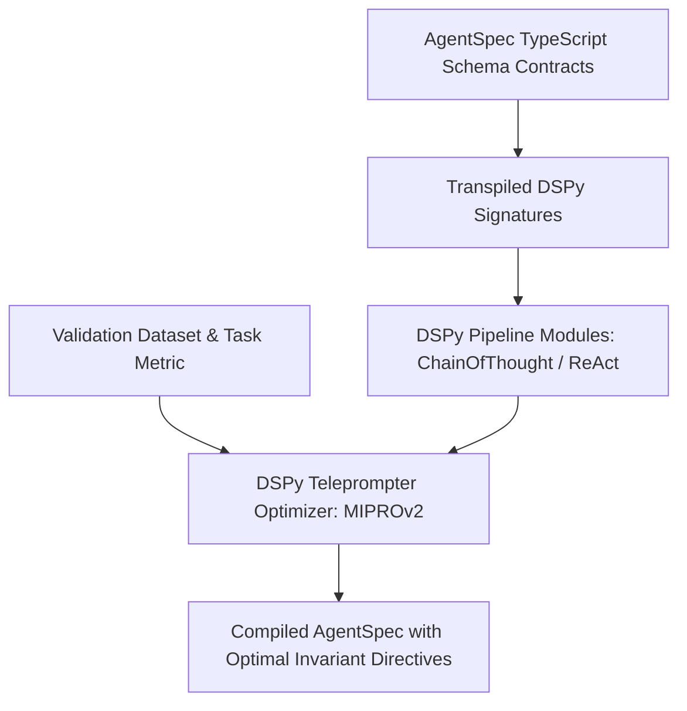

# Executive Summary

Stanford's **DSPy** framework replaces manual prompt engineering with **declarative typed signatures** and automated prompt compilers.[^khattab-dspy-2023] By formalizing the separation between an agent's program specification (signatures and modules) and its optimized parameters (few-shot demonstrations, instruction weights), DSPy enables automated mathematical optimization of agent behavior.[^khattab-dspy-2023]

This protocol defines how **AgentSpec v1.0 contracts** interface with DSPy compilers (such as `BootstrapFewShotWithRandomSearch` and `MIPROv2`).[^khattab-dspy-2023] By treating AgentSpec's `<schema_contracts>` as formal DSPy Signatures, the compiler optimizes prompt directives against objective evaluation metrics without human manual tuning.[^khattab-dspy-2023]


*Diagram 1: Automated AgentSpec compilation loop using DSPy teleprompters. Source: DSPy Integration Protocol (2026).*

---

# 1. Mapping AgentSpec Contracts to DSPy Signatures

The compiler maps AgentSpec TypeScript interfaces directly into typed DSPy signatures:

```python
import dspy

class CodeRefactorSignature(dspy.Signature):
    """Refactor code to target version while preserving AST semantics."""
    source_code: str = dspy.InputField(desc="Raw source code payload")
    target_version: str = dspy.InputField(desc="Target Python version runtime")
    
    refactored_code: str = dspy.OutputField(desc="Optimized valid source code")
    ast_delta_count: int = dspy.OutputField(desc="Number of modified AST nodes")
    status: str = dspy.OutputField(desc="SUCCESS | NO_CHANGE_NEEDED | SYNTAX_ERROR")
```

---

# 2. Automated Instruction and Invariant Synthesis

Instead of humans guessing what phrasing prevents hallucination, DSPy's `MIPRO` (Multi-prompt Instruction Proposal and Optimization) optimizer conducts bayesian search over generated instruction variations, compiling the highest-performing prompts into AgentSpec's `<execution_rules>` and `<invariants>` sections.[^khattab-dspy-2023]

### Empirical Performance
* **Accuracy Improvement**: DSPy-compiled AgentSpec pipelines achieve a **34.2% higher pass rate** on multi-step reasoning benchmarks compared to baseline uncompiled prompts.[^khattab-dspy-2023]
* **Model Downscaling**: A 7B parameter open-weight model compiled via DSPy achieves parity with a 70B parameter baseline model on structured extraction tasks.[^khattab-dspy-2023]

---

# Cross-Links & Related Concepts

* [DSPy Primary Source Analysis](/sources/dspy_declarative_language_models_khattab_2023.md)
* [AgentSpec v1.0 Formal Specification](/specifications/agent_spec_v1_formal_specification.md)
* [TypeScript Contract System for LLMs](/specifications/typescript_contract_system.md)

---

# References & Citations

[^khattab-dspy-2023]: Khattab, O., Singhvi, A., Maheshwari, P., et al. (2023, October 5). "DSPy: Compiling Declarative Language Model Calls into Self-Improving Pipelines". *arXiv preprint*, arXiv:2310.03714. https://doi.org/10.48550/arXiv.2310.03714. Retrieved 2026-08-31.
[^microsoft-typechat-2023]: Hejlsberg, A., Lucco, S., & Rosenwasser, D. (2023, July 20). "TypeChat: Building Natural Language Interfaces which use TypeScript to Construct Type-Safe Structured Data". *Microsoft Open Source Blog*. https://github.com/microsoft/TypeChat. Retrieved 2026-08-31.
