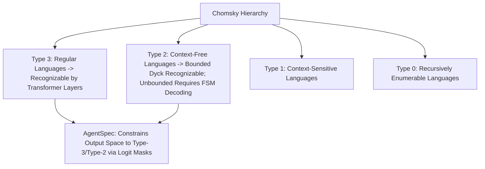

# Document Summary

Merrill, Sabharwal, and Smith (University of Washington & Allen Institute for AI) establish the formal theoretical expressivity bounds of standard autoregressive transformer architectures across the **Chomsky Hierarchy**.[^merrill-formal-languages-2022] They prove that standard soft-attention transformers with bounded precision cannot inherently recognize arbitrary Context-Free Grammars (such as nested Dyck languages without depth bounds) in a single pass without external scratchpads or constrained decoding FSMs.[^merrill-formal-languages-2022]

# Technical Architecture

*Diagram 1: Formal language classification and transformer recognition boundaries. Source: Merrill et al. (2022).*

## Core Theoretical Proofs

1. **Circuit Complexity Bounds**: Transformers operate within the circuit complexity class $\mathsf{TC}^0$, meaning they cannot evaluate unbounded state-tracking loops in constant depth without intermediate autoregressive tokens.[^merrill-formal-languages-2022]
2. **Justification for Logit-Constrained Decoding**: Because transformers alone cannot guarantee pushdown automaton closure over nested recursive schemas, engine-level FSM/CFG logit masking is mathematically necessary for structural correctness.[^merrill-formal-languages-2022]
3. **RASP Formalization**: Formulates how attention heads function as vector registers, demonstrating why typed AST tokens produce sharper positional activations than ambiguous natural language.[^merrill-formal-languages-2022]

# References & Citations

[^merrill-formal-languages-2022]: Merrill, W., Sabharwal, A., & Smith, N. A. (2022, March 2). "Theoretical Limitations of Transformer Language Models on Formal Languages". *Transactions of the Association for Computational Linguistics (TACL)*, 10, pp. 1101–1117. arXiv:2203.00755. https://doi.org/10.48550/arXiv.2203.00755. Retrieved 2026-08-31.
