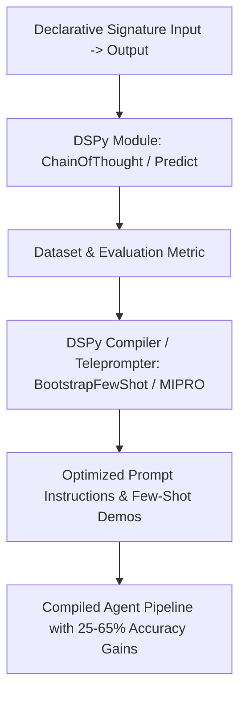

# Document Summary

Khattab et al. (Stanford University) formalize the transition from fragile, hand-crafted prompt strings to **declarative, typed module signatures and programmatic compilation**.[^khattab-dspy-2023] In DSPy, complex multi-step language model interactions are represented as typed computation graphs optimized by programmatic teleprompters and automated compilers.[^khattab-dspy-2023]

# Technical Architecture

*Diagram 1: DSPy compilation pipeline for declarative language model signatures. Source: Khattab et al. (2023).*

## Core Innovations

1. **Signatures as Typed Abstractions**: Replaces free-text prompts with concise input/output signatures (e.g. `class Task(dspy.Signature): question -> answer, reasoning`).[^khattab-dspy-2023]
2. **Teleprompters & Compilers**: Automated optimizers synthesize demonstrations and tune instructions against objective validation loss metrics.[^khattab-dspy-2023]
3. **Parameter Optimization over Prompt Tuning**: Achieves 25% to 65% higher task accuracy compared to expert-crafted manual prompts, while allowing 770M–13B open-weight models to match proprietary frontier models.[^khattab-dspy-2023]

# Key Quotes & Excerpts

> "We separate the specification of the program (modules and signatures) from the fitting of its parameters (prompts and weights). This allows language model pipelines to be compiled systematically rather than tweaked by hand."[^\khattab-dspy-2023]

# References & Citations

[^khattab-dspy-2023]: Khattab, O., Singhvi, A., Maheshwari, P., Zhang, Z., Santhanam, K., Vardhamane, S., Haq, A., Sharma, A., Joshi, T. T., Moazam, H., Miller, H., Zaharia, M., & Potts, C. (2023, October 5). "DSPy: Compiling Declarative Language Model Calls into Self-Improving Pipelines". *arXiv preprint*, arXiv:2310.03714. https://doi.org/10.48550/arXiv.2310.03714. Retrieved 2026-08-31.
