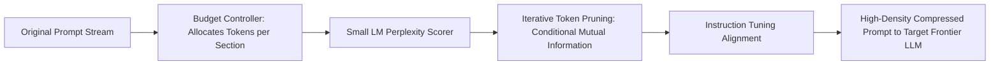

# Document Summary

Jiang et al. (Microsoft Research) introduce **LLMLingua**, a coarse-to-fine prompt compression framework presented at EMNLP 2023.[^jiang-llmlingua-2023] By using a compact, instruction-aligned language model (e.g. LLaMA-7B or GPT2-small) to measure token-level perplexity and mutual information, LLMLingua prunes non-essential tokens from large prompts, achieving **up to 20× compression ratios** with minimal performance degradation across reasoning and QA benchmarks.[^jiang-llmlingua-2023]

# Technical Architecture

*Diagram 1: LLMLingua coarse-to-fine prompt compression pipeline. Source: Jiang et al. (EMNLP 2023).*

## Core Findings & Innovations

1. **Budget Controller**: Allocates higher compression budgets to high-redundancy demonstration blocks while preserving mission-critical instructions and schema definitions.[^jiang-llmlingua-2023]
2. **Iterative Token Pruning**: Evaluates token dependencies dynamically, retaining critical syntactic anchor tokens necessary for AST parsing.[^jiang-llmlingua-2023]
3. **Inference Acceleration**: Reduces prompt token transmission and prefill compute by 70–90%, lowering end-to-end latency for long-context agent prompts.[^jiang-llmlingua-2023]

# References & Citations

[^jiang-llmlingua-2023]: Jiang, H., Wu, Q., Lin, C. Y., Yang, Y., & Qiu, L. (2023, October 9). "LLMLingua: Compressing Prompts for Accelerated Inference of Large Language Models". *Proceedings of the 2023 Conference on Empirical Methods in Natural Language Processing (EMNLP 2023)*, pp. 13358–13376. arXiv:2310.05736. https://doi.org/10.48550/arXiv.2310.05736. Retrieved 2026-08-31.
