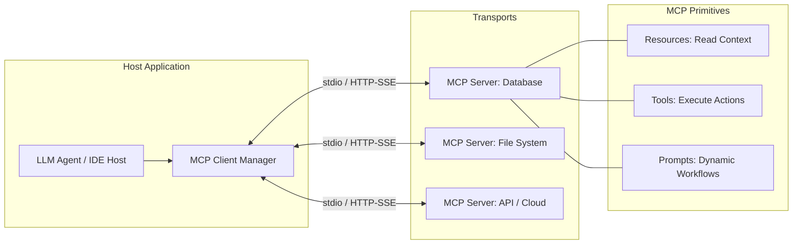

# Document Summary

Anthropic released the open **Model Context Protocol (MCP)** on November 25, 2024, to solve the "N×M integration crisis" in AI engineering.[^anthropic-mcp-2024] MCP establishes a standard JSON-RPC 2.0 client-host-server protocol for exposing context resources, executable tool functions, and dynamic prompt templates to autonomous agents.[^anthropic-mcp-2024]

# Technical Architecture

*Diagram 1: Model Context Protocol client-server architecture and primitive bindings. Source: Anthropic MCP Specification (2024).*

## Core Protocol Primitives

1. **Resources**: Read-only context data identified by URIs (e.g. `file:///schema.sql`, `postgres://metrics`), returning binary or text payloads.[^anthropic-mcp-2024]
2. **Tools**: Callable operations defined with JSON Schema input parameters and JSON-RPC execution endpoints.[^anthropic-mcp-2024]
3. **Prompts**: Server-managed prompt workflows and multi-turn templates parameterized for specific tasks.[^anthropic-mcp-2024]
4. **Transports**: Standard input/output (`stdio`) for local process isolation and Server-Sent Events (`HTTP/SSE`) for remote enterprise deployments.[^anthropic-mcp-2024]

# Key Quotes & Excerpts

> "MCP replaces fragmented, custom tool integrations with an open standard. Just as USB-C provided a universal physical connector, MCP provides a universal semantic connector between AI models and external systems."[^\anthropic-mcp-2024]

# References & Citations

[^anthropic-mcp-2024]: Anthropic (2024, November 25). "Model Context Protocol: An Open Standard for Connecting AI Models to Tools and Data". *Anthropic Engineering*. https://modelcontextprotocol.io/introduction. Retrieved 2026-08-31.
