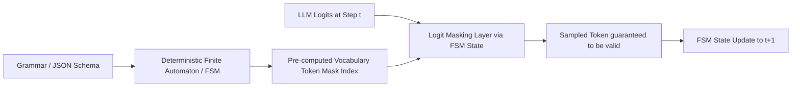

# Document Summary

In this foundational paper, Willard and Louf reformulate autoregressive language model decoding as state traversal through a deterministic **Finite-State Machine (FSM)** or pushdown automaton derived from regular expressions and Context-Free Grammars (CFGs).[^willard-louf-2023] By pre-computing index mappings between vocabulary token IDs and FSM states, their library (**Outlines**) enforces 100% syntactically valid JSON and regex outputs at zero runtime penalty.[^willard-louf-2023]

# Technical Architecture

*Diagram 1: FSM-guided token logit masking workflow. Source: Willard & Louf (2023).*

## Core Findings & Benchmarks

1. **Zero-Overhead Inference**: Unlike rejection sampling or backtracking parsers that incur quadratic latency degradation, FSM index lookups add less than 1 millisecond per token generation step.[^willard-louf-2023]
2. **100% Syntactic Guarantee**: Rejection rate for structured JSON outputs drops to 0.00%, completely eliminating JSON formatting hallucinations and parse errors in production agent systems.[^willard-louf-2023]
3. **Model-Agnostic Execution**: The technique operates directly on the output probability distribution of any standard autoregressive transformer without requiring model fine-tuning.[^willard-louf-2023]

# Key Quotes & Excerpts

> "We reformulate generation as a sequence of transitions in a finite-state machine. This allows us to guide generation with arbitrary regular expressions and context-free grammars with virtually no overhead."[^\willard-louf-2023]

# References & Citations

[^willard-louf-2023]: Willard, B. T., & Louf, R. (2023, July 18). "Efficient Guided Generation for Large Language Models". *arXiv preprint*, arXiv:2307.09702. https://doi.org/10.48550/arXiv.2307.09702. Retrieved 2026-08-31.
