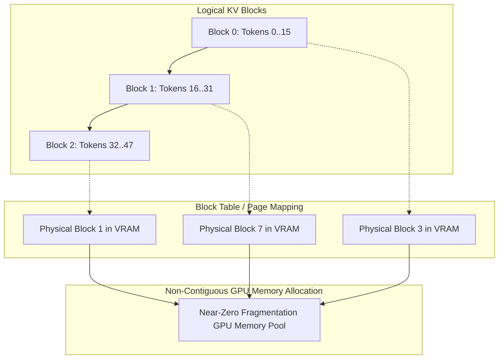

# Document Summary

Kwon et al. (UC Berkeley) introduce **PagedAttention** and the **vLLM** serving engine at SOSP 2023.[^kwon-pagedattention-2023] Inspired by virtual memory and paging in operating systems, PagedAttention partitions the Key-Value (KV) cache of LLM sequences into non-contiguous memory blocks, reducing memory fragmentation from **60%–80% to under 4%** and enabling **2× to 4× higher serving throughput** for concurrent agent swarms.[^kwon-pagedattention-2023]

# Technical Architecture

*Diagram 1: PagedAttention block mapping and non-contiguous memory management. Source: Kwon et al. (SOSP 2023).*

## Core Findings & Innovations

1. **Near-Zero Memory Waste**: Completely eliminates external and internal fragmentation by allocating KV cache tensors on demand in fixed-size blocks (e.g. 16 tokens).[^kwon-pagedattention-2023]
2. **Copy-on-Write for Parallel Swarms**: When an agent forks into multiple sub-agents, child processes share physical KV blocks via reference counters until a write occurs, enabling instant zero-memory branching.[^kwon-pagedattention-2023]
3. **High-Throughput Serving**: Dramatically increases maximum batch sizes, allowing hundreds of concurrent tool-calling agents to execute on a single GPU node.[^kwon-pagedattention-2023]

# References & Citations

[^kwon-pagedattention-2023]: Kwon, W., Li, Z., Zhuang, S., Sheng, Y., Zheng, L., Yu, C. H., Gonzalez, J. E., Zhang, H., & Stoica, I. (2023, September 12). "Efficient Memory Management for Large Language Model Serving with PagedAttention". *Proceedings of the 29th ACM Symposium on Operating Systems Principles (SOSP 2023)*, pp. 611–626. arXiv:2309.06180. https://doi.org/10.48550/arXiv.2309.06180. Retrieved 2026-08-31.
