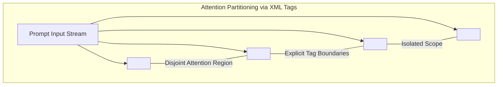

# Document Summary

Anthropic's engineering research establishes that formatting prompts with **explicit XML-style structural tags** (such as `<context>`, `<rules>`, `<schema>`, and `<documents>`) provides deterministic boundary markers that partition transformer attention, preventing instruction leakage, prompt injection, and delimiter confusion.[^anthropic-xml-prompting-2024]

# Technical Architecture

*Diagram 1: Disjoint attention partitioning achieved through explicit XML tag boundaries. Source: Anthropic Prompt Engineering Guidelines (2024).*

## Key Principles & Findings

1. **Deterministic Context Delimitation**: Models trained on tokenized code and markup treat opening (`<tag>`) and closing (`</tag>`) tags as rigid boundary scopes, preventing user data from hijacking instruction streams.[^anthropic-xml-prompting-2024]
2. **Elimination of Conversational Ambiguity**: Replacing multi-paragraph prose with typed XML blocks reduces instruction interpretation variance across repeated runs.[^anthropic-xml-prompting-2024]
3. **Hierarchical Nesting**: Allows complex multi-document reasoning tasks to be structured into explicit trees (e.g. `<documents><document id="1">...</document></documents>`).[^anthropic-xml-prompting-2024]

# References & Citations

[^anthropic-xml-prompting-2024]: Anthropic (2024, May 15). "Use XML Tags to Structure Prompts: Engineering Guidelines for Claude Models". *Anthropic Documentation*. https://docs.anthropic.com/en/docs/build-with-claude/prompt-engineering/use-xml-tags. Retrieved 2026-08-31.
