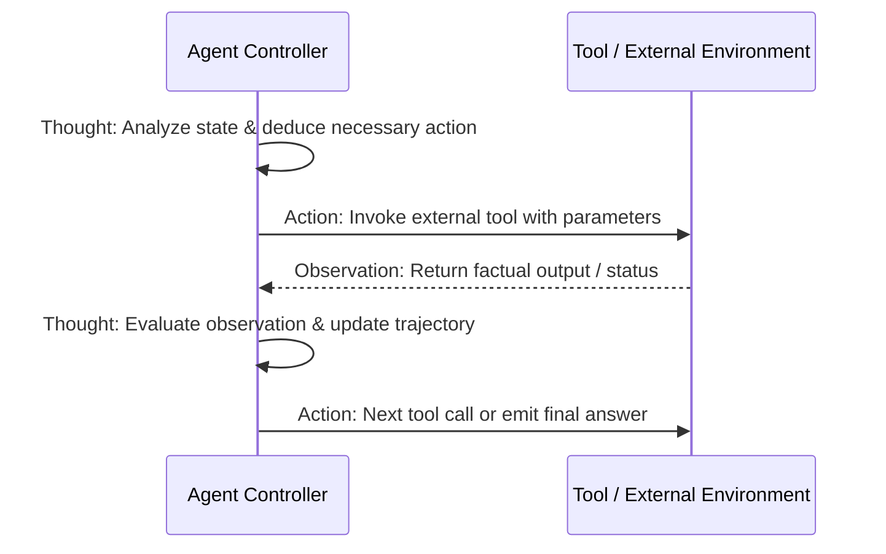

# Document Summary

Yao et al. introduce **ReAct** (Reason + Act), establishing the canonical paradigm for modern autonomous AI agents.[^yao-react-2022] By interleaving verbal reasoning traces ("Thought") with domain-specific external tool invocations ("Action") and environment feedback ("Observation"), ReAct enables models to perform multi-step planning, dynamically self-correct, and reduce factual hallucinations across complex decision environments.[^yao-react-2022]

# Technical Architecture

*Diagram 1: The cyclic ReAct Thought-Action-Observation loop. Source: Yao et al. (ICLR 2023).*

## Core Findings & Benchmarks

1. **Hallucination Suppression**: Grounding reasoning steps in verifiable environment observations dramatically reduced factual confabulation compared to isolated Chain-of-Thought (CoT) prompting.[^yao-react-2022]
2. **Error Recovery**: The reasoning trace allowed the model to diagnose tool errors, backtrack from dead ends, and retry alternative paths.[^yao-react-2022]
3. **Empirical Superiority**: Demonstrated state-of-the-art results across HotpotQA (multi-hop QA), FEVER (fact verification), ALFWorld (interactive text games), and WebShop (online shopping tasks).[^yao-react-2022]

# References & Citations

[^yao-react-2022]: Yao, S., Zhao, J., Yu, D., Du, N., Shafran, I., Narasimhan, K., & Cao, Y. (2022, October 6). "ReAct: Synergizing Reasoning and Acting in Language Models". *International Conference on Learning Representations (ICLR 2023)*. arXiv:2210.03629. https://doi.org/10.48550/arXiv.2210.03629. Retrieved 2026-08-31.
