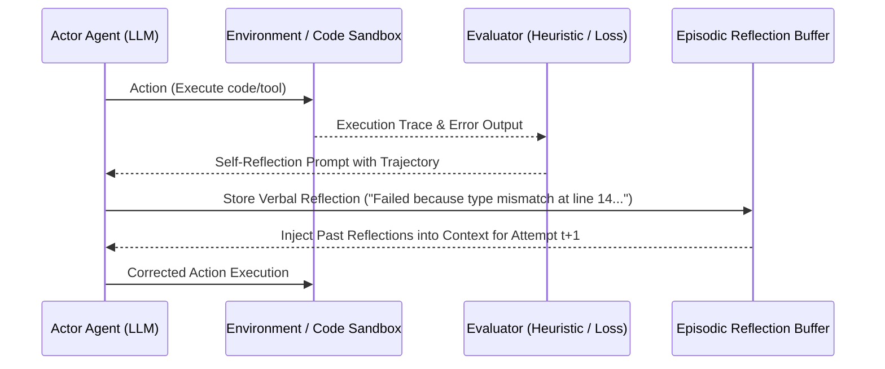

# Document Summary

Shinn et al. (Princeton & MIT) introduce **Reflexion**, a reinforcement learning paradigm published at NeurIPS 2023 that equips autonomous LLM agents with **verbal self-reflection and episodic memory buffers** instead of scalar weight updates.[^shinn-reflexion-2023] By evaluating execution trajectories, generating self-reflective feedback, and storing these linguistic learnings in working memory, Reflexion achieves a **91.0% pass@1 on HumanEval**, outperforming standard baseline models.[^shinn-reflexion-2023]

# Technical Architecture

*Diagram 1: Reflexion verbal reinforcement learning cycle. Source: Shinn et al. (NeurIPS 2023).*

## Core Findings & Innovations

1. **Verbal vs. Numeric Gradient Updates**: Language models optimize multi-step heuristics significantly faster when given semantic natural language critiques than scalar reward values.[^shinn-reflexion-2023]
2. **Episodic Memory Retention**: Maintaining a rolling buffer of 1–3 past failed attempts and verbal deductions prevents agents from repeating previously encountered failure modes.[^shinn-reflexion-2023]
3. **Multi-Domain Efficacy**: Validated across programming (HumanEval, MBPP), decision-making (ALFWorld), and multi-hop reasoning (HotpotQA).[^shinn-reflexion-2023]

# References & Citations

[^shinn-reflexion-2023]: Shinn, N., Cassano, F., Berman, E., Gopinath, A., Narasimhan, K., & Yao, S. (2023, March 20). "Reflexion: Language Agents with Verbal Reinforcement Learning". *Advances in Neural Information Processing Systems (NeurIPS 2023)*, 36. arXiv:2303.11366. https://doi.org/10.48550/arXiv.2303.11366. Retrieved 2026-08-31.
