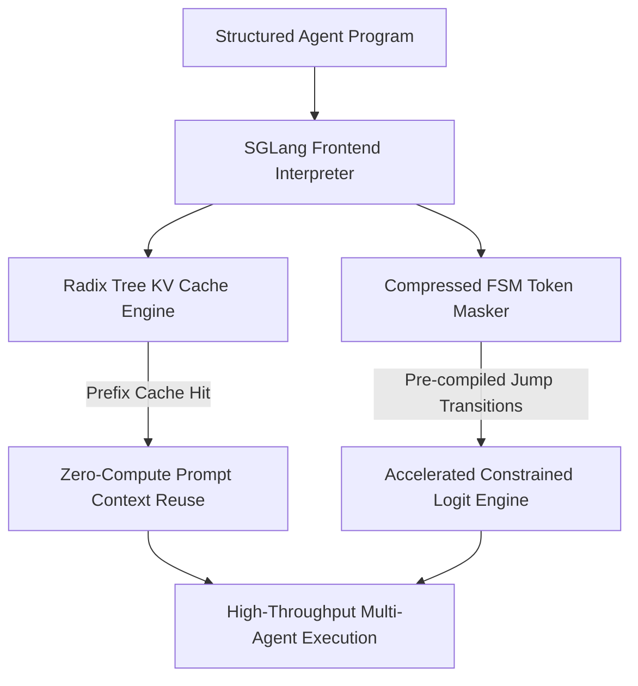

# Document Summary

Zheng et al. introduce **SGLang**, a co-designed frontend programming language and runtime execution engine engineered for high-throughput multi-call structured LLM programs.[^zheng-sglang-2023] By combining **RadixAttention** (prefix KV-cache sharing across complex branching agent trajectories) with **Compressed Finite-State Machines (FSMs)** for structured grammar decoding, SGLang achieves up to 6.4× higher execution throughput.[^zheng-sglang-2023]

# Technical Architecture

*Diagram 1: SGLang execution architecture showing RadixAttention and Compressed FSM jump decoding. Source: Zheng et al. (2023).*

## Core Findings & Innovations

1. **RadixAttention**: Maintains a radix tree of Key-Value caches across diverse prompt prefixes, allowing autonomous multi-turn agents to branch and backtrack with near-zero latency penalty.[^zheng-sglang-2023]
2. **Compressed FSM Jump Decoding**: Compresses consecutive deterministic token transitions into single jump steps, avoiding token-by-token mask recalculations during JSON decoding.[^zheng-sglang-2023]
3. **6.4× Throughput Improvement**: Outperforms conventional inference backends across JSON schema generation, retrieval-augmented pipelines, and multi-agent loops.[^zheng-sglang-2023]

# References & Citations

[^zheng-sglang-2023]: Zheng, L., Yin, L., Xie, Z., Sun, C., Huang, J., Yu, C. H., Cao, S., Christodoulou, C., Yang, E. K., Gonzalez, J. E., & Stoica, I. (2023, December 12). "SGLang: Efficient Execution of Structured Language Model Programs". *arXiv preprint*, arXiv:2312.07104. https://doi.org/10.48550/arXiv.2312.07104. Retrieved 2026-08-31.
