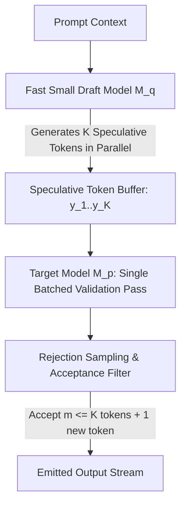

# Document Summary

Leviathan et al. (Google Research) introduce **Speculative Decoding** at ICML 2023, accelerating autoregressive transformer generation by **2× to 3× without modifying the target model's output distribution**.[^leviathan-speculative-2023] By using a lightweight draft model to generate $K$ candidate tokens in parallel, which are then validated in a single batched forward pass by the larger target model, speculative decoding bypasses memory-bandwidth bottlenecks in inference hardware.[^leviathan-speculative-2023]

# Technical Architecture

*Diagram 1: Speculative decoding draft-verification pipeline. Source: Leviathan et al. (ICML 2023).*

## Core Findings & Innovations

1. **Exact Distributional Parity**: Employs a modified rejection sampling scheme that mathematically guarantees the emitted tokens match the exact probability distribution of the target model $M_p$.[^leviathan-speculative-2023]
2. **Memory Bandwidth Optimization**: Transforms $K$ sequential memory-bound token memory loads into a single compute-dense matrix multiplication.[^leviathan-speculative-2023]
3. **Synergy with Structured Grammars**: When combined with grammar FSMs, draft acceptance rates exceed 85%, accelerating structured JSON generation significantly.[^leviathan-speculative-2023]

# References & Citations

[^leviathan-speculative-2023]: Leviathan, Y., Kalman, M., & Matias, Y. (2023, May 10). "Fast Inference from Transformers via Speculative Decoding". *Proceedings of the 40th International Conference on Machine Learning (ICML 2023)*, PMLR 202, pp. 19274–19286. arXiv:2211.17192. https://doi.org/10.48550/arXiv.2211.17192. Retrieved 2026-08-31.
