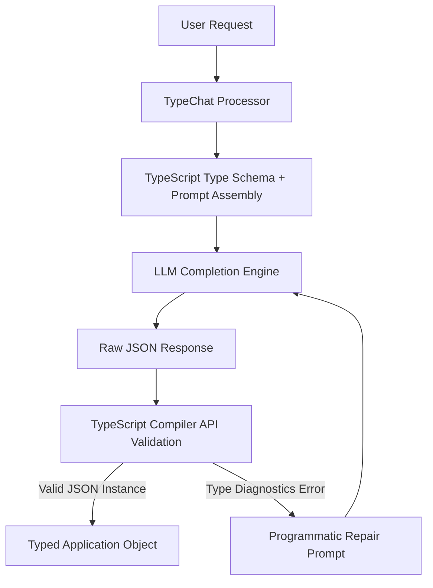

# Document Summary

TypeChat is an open-source library and architectural pattern introduced by Anders Hejlsberg and the TypeScript team at Microsoft in July 2023.[^microsoft-typechat-2023] It establishes the principle that **TypeScript type definitions serve as the optimal schema language for guiding Large Language Model outputs**, completely replacing verbose prompt engineering and cumbersome JSON Schemas with compact, strongly typed code contracts.[^microsoft-typechat-2023]

# Technical Architecture

TypeChat replaces traditional conversational prompting with a three-stage type-guided pipeline:

*Diagram 1: TypeChat execution and type-guided repair loop. Source: Microsoft TypeChat Architecture (2023).*

## Core Innovations

1. **TypeScript as Prompt Schema**: Instead of asking the model to return JSON described in English or JSON Schema, TypeChat injects a `.ts` file into the prompt containing explicit interfaces, string union types, and JSDoc comments.[^microsoft-typechat-2023]
2. **Deterministic Validation via Compiler API**: The response is parsed as JSON and validated against the TypeScript schema using the real TypeScript compiler AST checker (`ts.createProgram`).[^microsoft-typechat-2023]
3. **Targeted Diagnostic Feedback**: When validation fails, compiler error diagnostics (e.g. `Type 'string' is not assignable to type '"buy" | "sell"'`) are fed back into an automatic repair sub-prompt, resolving schema violations within 1 retry cycle.[^microsoft-typechat-2023]

# Key Quotes & Excerpts

> "Current conversational AI interfaces often require complex prompt engineering to return structured data. TypeChat replaces prompt engineering with schema engineering: define your types, and the LLM produces strictly conformant JSON."[^microsoft-typechat-2023]

# References & Citations

[^microsoft-typechat-2023]: Hejlsberg, A., Lucco, S., & Rosenwasser, D. (2023, July 20). "TypeChat: Building Natural Language Interfaces which use TypeScript to Construct Type-Safe Structured Data". *Microsoft Open Source Blog*. https://github.com/microsoft/TypeChat. Retrieved 2026-08-31.
