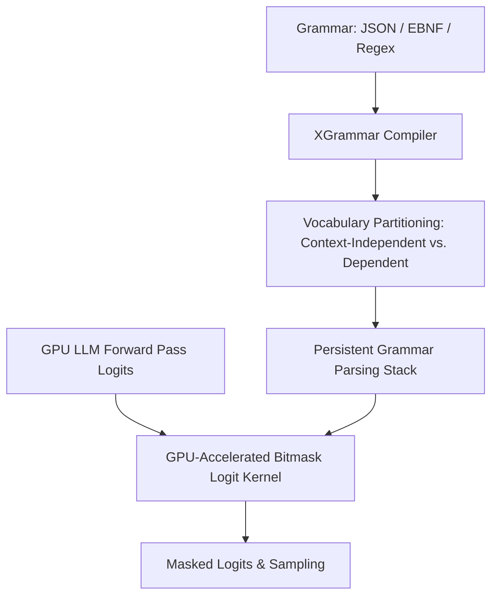

# Document Summary

Dong et al. (MLC AI team, Carnegie Mellon University) introduce **XGrammar**, an open-source structured generation engine engineered to eliminate the CPU-GPU bottleneck in grammar-constrained LLM decoding.[^dong-xgrammar-2024] While previous systems suffered from severe latency degradation when evaluating complex Context-Free Grammars (CFGs) and JSON schemas, XGrammar achieves **up to 100× speedups** by pre-dividing model vocabularies into context-independent and context-dependent partitions, executing GPU-parallel bitmask kernels, and maintaining persistent parser stacks.[^dong-xgrammar-2024]

# Technical Architecture

*Diagram 1: XGrammar dual-partition vocabulary masking and persistent parser pipeline. Source: Dong et al. (2024).*

## Core Innovations

1. **Dual Vocabulary Partitioning**: Classifies vocabulary tokens into *context-independent tokens* (which are always valid or invalid at specific grammar states, pre-compiled into static bitmasks) and *context-dependent tokens* (dynamically evaluated via a fast persistent stack parser).[^dong-xgrammar-2024]
2. **GPU Kernel Co-Design**: Eliminates host-device memory round-trips by running grammar bitmask operations directly in GPU VRAM concurrent with transformer attention layers.[^dong-xgrammar-2024]
3. **Universal Engine Adoption**: Integrated natively into major production runtimes including vLLM, SGLang, MLC-LLM, and TensorRT-LLM.[^dong-xgrammar-2024]

# References & Citations

[^dong-xgrammar-2024]: Dong, Y., Ruan, C. F., Cai, Y., Lai, R., Xu, Z., Zhao, Y., & Chen, T. (2024, November 22). "XGrammar: Flexible and Efficient Structured Generation Engine for Large Language Models". *arXiv preprint*, arXiv:2411.15100. https://doi.org/10.48550/arXiv.2411.15100. Retrieved 2026-08-31.
