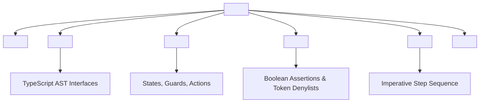

# 1. Specification Overview

**AgentSpec v1.0** is an open, machine-first specification standard for defining autonomous LLM agent roles, execution contracts, state transitions, and output grammars.[^anthropic-xml-prompting-2024] It strips away human conversational conventions, replacing them with a deterministic, token-dense structural markup.[^microsoft-typechat-2023]

---

# 2. Tag Grammar and Hierarchy

An AgentSpec v1.0 instruction packet MUST be enclosed within a root `<agent_spec>` XML block adhering to the following schema structure:

```xml
<agent_spec version="1.0.0" id="UNIQUE_AGENT_IDENTIFIER">
  <role>EXACT_ROLE_STATEMENT</role>
  
  <schema_contracts language="typescript">
    <!-- TypeScript interfaces defining input and output payloads -->
  </schema_contracts>
  
  <state_machine initial="STATE_ID">
    <!-- Deterministic state transitions, actions, and guards -->
  </state_machine>
  
  <invariants>
    <!-- Non-negotiable boolean assertions and forbidden token patterns -->
  </invariants>
  
  <execution_rules>
    <!-- Stepwise imperative execution pipeline -->
  </execution_rules>
  
  <output_contract enforcement="GBNF | JSON_SCHEMA | RAW_PARSED">
    <!-- Target payload specification -->
  </output_contract>
</agent_spec>
```


*Diagram 1: Formal tag hierarchy of the AgentSpec v1.0 standard. Generated by Deep Research Agent (2026).*

---

# 3. Section Specifications

### 3.1 `<role>` (Required)
A single, unambiguous statement declaring the agent's deterministic operational objective. Must not contain greeting or introductory prose.
* Example: `<role>Deterministic SQL Query Optimization and Index Synthesizer</role>`

### 3.2 `<schema_contracts>` (Required)
Contains valid TypeScript code defining:
* `InputPayload`: Shape of the input data stream.
* `OutputPayload`: Shape of the target response.
* `ErrorPayload`: Structured error objects for graceful failure routing.
* `ToolPayloads`: Definitions of any invokable tools.[^microsoft-typechat-2023]

### 3.3 `<state_machine>` (Required)
Defines the permissible execution graph. The FSM prevents unbounded execution loops and enforces terminal states:[^willard-louf-2023]
```text
STATES: [IDLE, VALIDATING, COMPUTING, REPAIRING, TERMINATED]
TRANSITIONS:
  IDLE -> VALIDATING: on receive(InputPayload)
  VALIDATING -> COMPUTING: if input_valid == true
  VALIDATING -> TERMINATED: if input_valid == false -> emit(ErrorPayload)
  COMPUTING -> TERMINATED: emit(OutputPayload)
```

### 3.4 `<invariants>` (Required)
A list of absolute boolean conditions that the model must evaluate prior to emitting tokens:
* `ASSERT: <expression>`: Must evaluate to true.
* `FORBIDDEN: [<tokens>]`: Explicit denylist of tokens or patterns (e.g. conversational filler, markdown formatting outside JSON).

### 3.5 `<execution_rules>` (Required)
An ordered numerical pipeline of imperative instructions. Replaces descriptive paragraphs with pseudo-algorithmic steps.

### 3.6 `<output_contract>` (Required)
Specifies the exact grammar enforcement engine (e.g., `GBNF_GRAMMAR`, `STRUCTURED_OUTPUTS_JSON`, or `RAW_PARSED`).

---

# 4. Reference Implementation Example

```xml
<agent_spec version="1.0.0" id="code_refactor_v1">
<role>AST-Preserving Python 3.12 Code Refactor Engine</role>

<schema_contracts language="typescript">
interface RefactorInput {
  filename: string;
  source_code: string;
  target_python_version: "3.11" | "3.12" | "3.13";
  max_line_length: number;
}

type RefactorStatus = "SUCCESS" | "NO_CHANGE_NEEDED" | "SYNTAX_ERROR";

interface RefactorOutput {
  status: RefactorStatus;
  refactored_code?: string;
  ast_node_delta_count: number;
  error_message?: string;
}
</schema_contracts>

<state_machine initial="IDLE">
STATES: [IDLE, PARSE_AST, TRANSFORM, VALIDATE_AST, TERMINATED]
TRANSITIONS:
  IDLE -> PARSE_AST: on receive(RefactorInput)
  PARSE_AST -> TRANSFORM: if ast.is_valid() == true
  PARSE_AST -> TERMINATED: if ast.is_valid() == false -> emit(status="SYNTAX_ERROR", error_message=ast.error)
  TRANSFORM -> VALIDATE_AST: apply_transformations()
  VALIDATE_AST -> TERMINATED: if ast_parity == true -> emit(RefactorOutput)
</state_machine>

<invariants>
ASSERT: output.ast_node_delta_count >= 0
ASSERT: output.status == "SUCCESS" IFF output.refactored_code != undefined
FORBIDDEN: [markdown_code_blocks_around_json, conversational_preamble, apologies]
</invariants>

<execution_rules>
1. Parse `source_code` into Python AST.
2. If parse fails, transition to TERMINATED with status="SYNTAX_ERROR".
3. Apply structural optimizations matching `target_python_version`.
4. Validate that output AST matches original execution semantics.
5. Return raw JSON strictly matching `RefactorOutput`.
</execution_rules>

<output_contract enforcement="STRUCTURED_OUTPUTS_JSON">
RefactorOutput
</output_contract>
</agent_spec>
```

---

# Cross-Links & Related Concepts

* [Machine-Optimized Agent Architecture](/foundations/machine_optimized_agent_architecture.md)
* [TypeScript Contract System for LLMs](/specifications/typescript_contract_system.md)
* [Finite State Machine Agent DSL](/specifications/finite_state_machine_agent_dsl.md)
* [Constrained Decoding and Grammars](/mechanisms/constrained_decoding_and_grammars.md)

---

# References & Citations

[^anthropic-xml-prompting-2024]: Anthropic (2024, May 15). "Use XML Tags to Structure Prompts: Engineering Guidelines for Claude Models". *Anthropic Documentation*. https://docs.anthropic.com/en/docs/build-with-claude/prompt-engineering/use-xml-tags. Retrieved 2026-08-31.
[^microsoft-typechat-2023]: Hejlsberg, A., Lucco, S., & Rosenwasser, D. (2023, July 20). "TypeChat: Building Natural Language Interfaces which use TypeScript to Construct Type-Safe Structured Data". *Microsoft Open Source Blog*. https://github.com/microsoft/TypeChat. Retrieved 2026-08-31.
[^willard-louf-2023]: Willard, B. T., & Louf, R. (2023, July 18). "Efficient Guided Generation for Large Language Models". *arXiv preprint*, arXiv:2307.09702. https://doi.org/10.48550/arXiv.2307.09702. Retrieved 2026-08-31.
