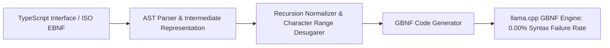

# 1. Specification Overview

While **Extended Backus-Naur Form (ISO/IEC 14977 EBNF)** is the international standard for defining formal computer languages, local LLM inference engines (notably `llama.cpp` and GGML backends) execute grammars encoded in **GBNF (Grammar-Based BNF)**.[^willard-louf-2023] [^ugare-syncode-2024]

This specification defines the deterministic compiler transformation mapping arbitrary EBNF schemas and TypeScript interface ASTs into optimized GBNF production rules for logit-level sampling constraints.[^willard-louf-2023]


*Diagram 1: EBNF to GBNF compilation pipeline. Source: AgentSpec Compiler Suite (2026).*

---

# 2. Formal Grammar Mapping Rules

### 2.1 Repetition and Quantifiers
* **EBNF Zero-or-More (`{ A }`)** $\longrightarrow$ **GBNF Rule**: `a_star ::= A a_star | ""`
* **EBNF One-or-More (`{ A }-`)** $\longrightarrow$ **GBNF Rule**: `a_plus ::= A a_star`
* **EBNF Optional (`[ A ]`)** $\longrightarrow$ **GBNF Rule**: `a_opt ::= A | ""`

### 2.2 Character Sets and Ranges
* **EBNF Range (`'a' .. 'z'`)** $\longrightarrow$ **GBNF Set**: `[a-z]`
* **GBNF Whitespace Rule**: `ws ::= [ \t\n]*`

---

# 3. Canonical Compilation Example: Agent Tool Call

### Source TypeScript Interface:
```typescript
interface DatabaseQuery {
  table: "users" | "logs";
  limit: number;
}
```

### Compiled GBNF Production Rules:
```text
root ::= "{" ws "\"table\":" ws table_val "," ws "\"limit\":" ws [0-9]+ ws "}"
table_val ::= "\"users\"" | "\"logs\""
ws ::= [ \t\n]*
```

---

# Cross-Links & Related Concepts

* [Constrained Decoding and Grammars](/mechanisms/constrained_decoding_and_grammars.md)
* [XGrammar Hardware-Accelerated Decoding](/mechanisms/xgrammar_hardware_accelerated_decoding.md)
* [SynCode Primary Source Document](/sources/syncode_grammar_guided_generation_ugare_2024.md)

---

# References & Citations

[^willard-louf-2023]: Willard, B. T., & Louf, R. (2023, July 18). "Efficient Guided Generation for Large Language Models". *arXiv preprint*, arXiv:2307.09702. https://doi.org/10.48550/arXiv.2307.09702. Retrieved 2026-08-31.
[^ugare-syncode-2024]: Ugare, S., Suresh, T., Kang, H., et al. (2024, March 4). "SynCode: Grammar-Augmented LLM Generation via Incremental LR Parser States". *arXiv preprint*, arXiv:2403.01632. https://doi.org/10.48550/arXiv.2403.01632. Retrieved 2026-08-31.
