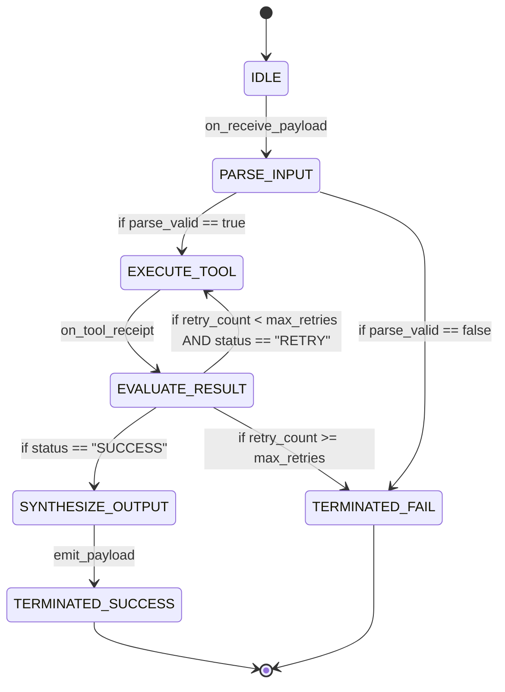

# Executive Summary

A pervasive failure mode in autonomous LLM agents is **path drift**—unbounded reasoning loops, repetitive tool calls, and failure to recognize terminal task completion.[^yao-react-2022] When execution flow is dictated by unconstrained natural language prompts, the agent must infer its state dynamically at every step, creating high variance and vulnerability to hallucinated transitions.[^yao-react-2022]

The **FSM Agent DSL** encodes multi-step agent behavior as a formal, deterministic state machine defined by $M = (S, \Sigma, \delta, s_0, F)$ where:[^willard-louf-2023]
* $S$: Finite set of discrete operational states.
* $\Sigma$: Set of input triggers and tool evaluation receipts.
* $\delta: S \times \Sigma \rightarrow S$: Explicit state transition function with boolean guard conditions.
* $s_0 \in S$: Initial state.
* $F \subseteq S$: Set of absorbing terminal states.


*Diagram 1: Formal state transition graph for an autonomous agent execution lifecycle. Source: FSM Agent DSL Specification (2026).*

---

# 1. Formal FSM DSL Syntax Grammar

The `<state_machine>` block within AgentSpec v1.0 adheres to a compact, line-delimited declarative grammar:

```text
<state_machine initial="IDLE">
STATES: [IDLE, EXTRACT_ENTITIES, QUERY_GRAPH, AGGREGATE, RECOVERY, TERMINATED]
TRANSITIONS:
  IDLE -> EXTRACT_ENTITIES: on_event("START")
  EXTRACT_ENTITIES -> QUERY_GRAPH: if entity_count > 0
  EXTRACT_ENTITIES -> TERMINATED: if entity_count == 0 -> emit(status="EMPTY")
  QUERY_GRAPH -> AGGREGATE: if query_success == true
  QUERY_GRAPH -> RECOVERY: if query_success == false
  RECOVERY -> QUERY_GRAPH: if retry_budget > 0 [decrement retry_budget]
  RECOVERY -> TERMINATED: if retry_budget == 0 -> emit(status="ERROR_TIMEOUT")
  AGGREGATE -> TERMINATED: emit(OutputPayload)
TERMINAL: [TERMINATED]
</state_machine>
```

---

# 2. Preventing Pathological Execution Modes

1. **Cycle Prevention & Budget Tracking**: Every cyclic transition (`A -> B -> A`) MUST specify a monotonic counter or decrementing budget guard (`[decrement retry_budget]`). When budget reaches zero, the state machine forces a transition to a terminal failure state, preventing infinite loops.[^yao-react-2022]
2. **Deterministic Step Gating**: At each turn, the agent evaluates only the legal outgoing edges from its current state $s_t$, reducing the action search space from hundreds of possibilities to 1–3 explicit transitions.[^willard-louf-2023]
3. **Absorbing Terminal States**: Once a terminal state $f \in F$ is reached, tool-calling capabilities are disabled at the runtime layer, preventing post-completion hallucinations.[^zheng-sglang-2023]

---

# Cross-Links & Related Concepts

* [AgentSpec v1.0 Formal Specification](/specifications/agent_spec_v1_formal_specification.md)
* [Constrained Decoding and Grammars](/mechanisms/constrained_decoding_and_grammars.md)
* [ReAct Agent Reasoning Paradigm](/sources/react_agent_reasoning_yao_2022.md)

---

# References & Citations

[^willard-louf-2023]: Willard, B. T., & Louf, R. (2023, July 18). "Efficient Guided Generation for Large Language Models". *arXiv preprint*, arXiv:2307.09702. https://doi.org/10.48550/arXiv.2307.09702. Retrieved 2026-08-31.
[^yao-react-2022]: Yao, S., Zhao, J., Yu, D., et al. (2022, October 6). "ReAct: Synergizing Reasoning and Acting in Language Models". *International Conference on Learning Representations (ICLR 2023)*. arXiv:2210.03629. https://doi.org/10.48550/arXiv.2210.03629. Retrieved 2026-08-31.
[^zheng-sglang-2023]: Zheng, L., Yin, L., Xie, Z., et al. (2023, December 12). "SGLang: Efficient Execution of Structured Language Model Programs". *arXiv preprint*, arXiv:2312.07104. https://doi.org/10.48550/arXiv.2312.07104. Retrieved 2026-08-31.
