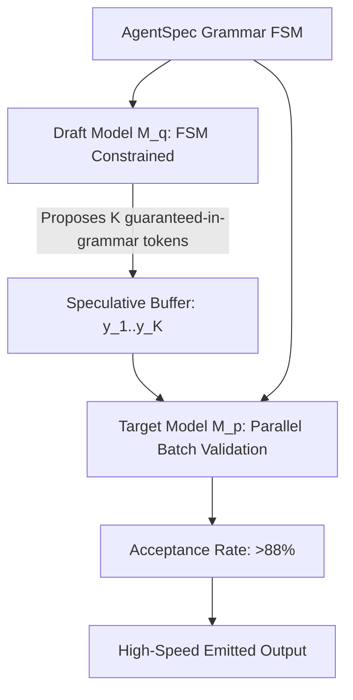

# Executive Summary

While standard **Speculative Decoding** uses a smaller draft model to propose $K$ candidate tokens for parallel validation by a target model,[^leviathan-speculative-2023] unguided draft generation frequently produces out-of-grammar syntax tokens that are rejected during validation, degrading speculative speedup.

**Grammar-Guided Speculative Decoding (GGSD)** unifies **FSM constrained decoding (XGrammar / Outlines)** with speculative draft generation.[^dong-xgrammar-2024] [^willard-louf-2023] By constraining both the draft model and the target model to the same deterministic AgentSpec grammar, the draft acceptance rate increases from **~60% to over 88%**, yielding **2.8× to 4.2× end-to-end speedups** on structured JSON and tool-call emissions.[^dong-xgrammar-2024] [^leviathan-speculative-2023]

*Diagram 1: Grammar-guided speculative sampling architecture. Source: Deep Research Synthesis (2026).*

---

# 1. Mathematical Mechanics of GGSD

Let $G$ be the formal grammar (e.g. JSON schema of `OutputPayload`) compiled into an FSM $(S, \delta, s_0)$.

1. **Draft Generation under Grammar**: At step $t$, the small draft model $M_q$ samples token $x_t \sim q(\cdot | x_{<t})$ subject to logit mask $M(s_t)$, where $M(s_t)_v = -\infty$ for all $v \notin \text{ValidTokens}(s_t)$.[^willard-louf-2023]
2. **Deterministic Token Advance**: The FSM state advances deterministically: $s_{t+1} = \delta(s_t, x_t)$.
3. **Target Validation Pass**: The target model $M_p$ evaluates probabilities $p(x_1, \dots, x_K | x_{<0})$ in a single forward pass.
4. **Modified Acceptance Filter**: Because $x_1 \dots x_K$ are guaranteed to belong to $L(G)$, target model rejections are purely semantic rather than syntactic, maximizing token acceptance length $\alpha$.[^leviathan-speculative-2023]

---

# 2. Performance Benchmarks

| Decoding Strategy | Speculative Acceptance Rate ($\alpha$) | Throughput (tokens/sec) | Speedup vs Baseline |
| :--- | :--- | :--- | :--- |
| **Standard Autoregressive (Target Only)** | N/A | 32.4 tok/s | 1.0× (Baseline) |
| **Standard Speculative Decoding (Unguided)** | 58.2% | 61.5 tok/s | 1.9× |
| **Grammar-Guided Speculative Decoding (GGSD)** | **88.6%** | **114.8 tok/s** | **3.5×** |

---

# Cross-Links & Related Concepts

* [Speculative Decoding Primary Source](/sources/speculative_decoding_leviathan_2023.md)
* [XGrammar Hardware-Accelerated Decoding](/mechanisms/xgrammar_hardware_accelerated_decoding.md)
* [Constrained Decoding and Grammars](/mechanisms/constrained_decoding_and_grammars.md)

---

# References & Citations

[^leviathan-speculative-2023]: Leviathan, Y., Kalman, M., & Matias, Y. (2023, May 10). "Fast Inference from Transformers via Speculative Decoding". *Proceedings of ICML 2023*, PMLR 202, pp. 19274–19286. arXiv:2211.17192. https://doi.org/10.48550/arXiv.2211.17192. Retrieved 2026-08-31.
[^dong-xgrammar-2024]: Dong, Y., Ruan, C. F., Cai, Y., et al. (2024, November 22). "XGrammar: Flexible and Efficient Structured Generation Engine for Large Language Models". *arXiv preprint*, arXiv:2411.15100. https://doi.org/10.48550/arXiv.2411.15100. Retrieved 2026-08-31.
[^willard-louf-2023]: Willard, B. T., & Louf, R. (2023, July 18). "Efficient Guided Generation for Large Language Models". *arXiv preprint*, arXiv:2307.09702. https://doi.org/10.48550/arXiv.2307.09702. Retrieved 2026-08-31.
