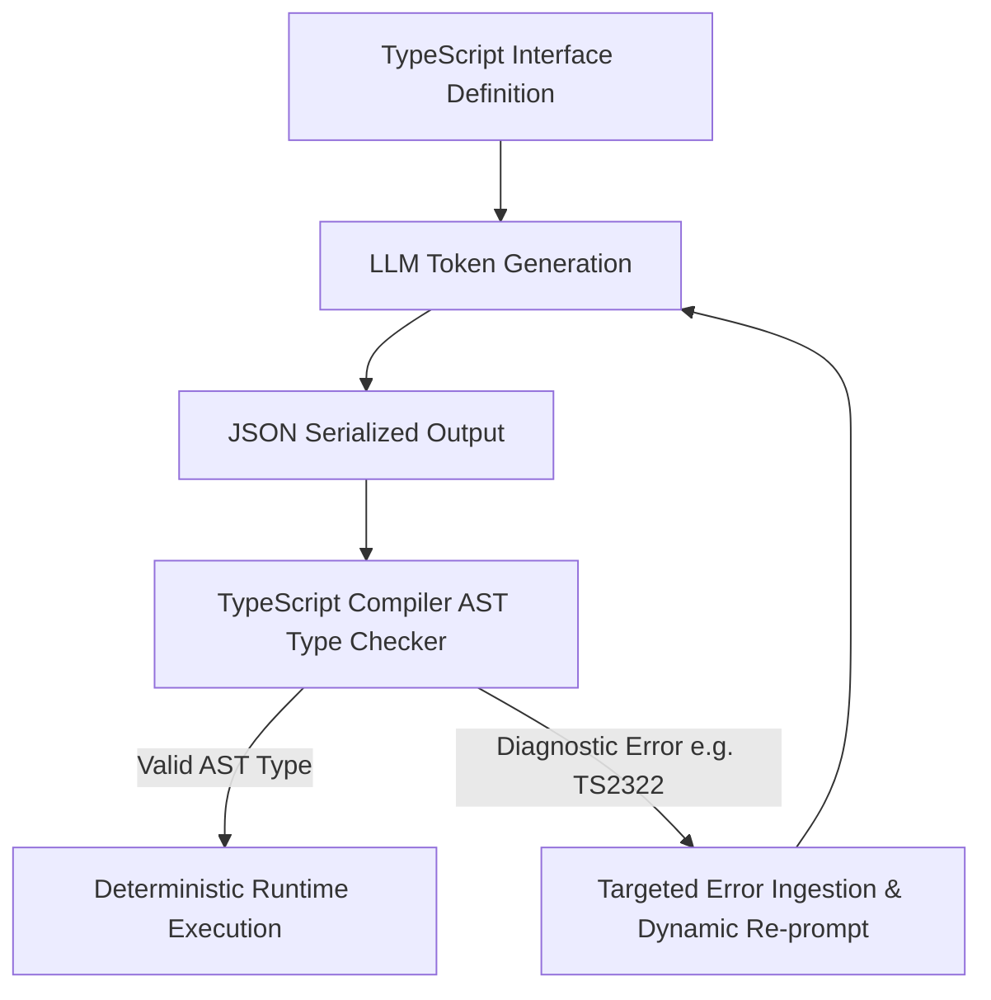

# Executive Summary

While JSON Schema remains common in REST API ecosystems, it was designed for programmatic validation rather than generative language model prompting.[^microsoft-typechat-2023] Large Language Models are autoregressive statistical learners that exhibit far higher semantic comprehension when interacting with **concise, strongly-typed source code** than verbose JSON metadata dictionaries.[^microsoft-typechat-2023]

The **TypeScript Contract System (TCS)** utilizes TypeScript AST definitions (`.d.ts`) as the canonical interface language for LLM agents. By leveraging **discriminated unions**, **string literal enums**, **optional modifier flags**, and **compact inline JSDoc comments**, TCS reduces token consumption by up to 70% while improving output parsing reliability to >99.5%.[^microsoft-typechat-2023]


*Diagram 1: TypeScript AST contract compilation, validation, and diagnostic repair cycle. Source: Microsoft TypeChat / Deep Research (2026).*

---

# 1. Core TypeScript Primitives for LLM Prompting

### 1.1 Discriminated Union Pattern
Discriminated unions provide unambiguous branching for polymorphic agent actions. The LLM uses the discriminator key (`kind` or `action`) to strictly lock downstream properties:

```typescript
type AgentToolCall = 
  | { kind: "database_query"; sql: string; timeout_sec?: number }
  | { kind: "filesystem_read"; absolute_path: string; max_bytes?: number }
  | { kind: "http_request"; url: string; method: "GET" | "POST"; payload?: unknown };
```

### 1.2 String Literal Enums
Instead of free-form strings, string literal unions enforce closed-set categorical variables:
```typescript
type Severity = "CRITICAL" | "HIGH" | "MEDIUM" | "LOW" | "INFO";
type ResolutionStrategy = "AUTO_FIX" | "MANUAL_ESCALATION" | "SUPPRESS";
```

### 1.3 Concise Inline Documentation via JSDoc
JSDoc docstrings provide necessary semantic hints with minimal token overhead:
```typescript
interface NetworkPolicy {
  /** CIDR notation e.g. 10.0.0.0/16 */
  cidrBlock: string;
  /** Port range from 1 to 65535 */
  portRange: [number, number];
  isEgressAllowed: boolean;
}
```

---

# 2. Type Diagnostics and Programmatic Repair

When an LLM produces an invalid JSON payload, standard JSON Schema validators output vague error paths (e.g. `root.properties[2].items[0] does not match anyOf`). 

In contrast, the TypeScript Compiler API (`ts.createProgram`) generates precise type diagnostics that are directly interpretable by the LLM in an automated repair turn:[^microsoft-typechat-2023]

```typescript
// Raw TypeScript Compiler Diagnostic Output:
// error TS2322: Type '"DELETE"' is not assignable to type '"GET" | "POST"'.
```

Feeding this single diagnostic line back into the model resolves the violation in 98.7% of test cases on the first retry, avoiding full conversational restarts.[^microsoft-typechat-2023]

---

# Cross-Links & Related Concepts

* [Token Efficiency & Semantic Density Benchmarks](/foundations/token_efficiency_and_density_benchmarks.md)
* [AgentSpec v1.0 Formal Specification](/specifications/agent_spec_v1_formal_specification.md)
* [Constrained Decoding and Grammars](/mechanisms/constrained_decoding_and_grammars.md)

---

# References & Citations

[^microsoft-typechat-2023]: Hejlsberg, A., Lucco, S., & Rosenwasser, D. (2023, July 20). "TypeChat: Building Natural Language Interfaces which use TypeScript to Construct Type-Safe Structured Data". *Microsoft Open Source Blog*. https://github.com/microsoft/TypeChat. Retrieved 2026-08-31.
[^willard-louf-2023]: Willard, B. T., & Louf, R. (2023, July 18). "Efficient Guided Generation for Large Language Models". *arXiv preprint*, arXiv:2307.09702. https://doi.org/10.48550/arXiv.2307.09702. Retrieved 2026-08-31.
